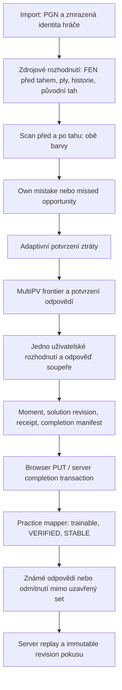

# Audit standardní analýzy a Practice v Backranq

Navazující uživatelské upřesnění a návrh architektury:
[Směr extrakce Practice](standard-analysis-product-direction.md). Níže zůstává
audit původního chování; navazující dokument odděluje přijaté produktové principy
od dosud neimplementovaného návrhu.

**Stav: dokončená první auditní fáze, nikoli potvrzení správnosti celého produktu.** Jsou reprodukovány blokující chyby předání i chyby společného šachového kontraktu. Byla změřena menší reprodukovatelná baseline a připraven návrh oprav. Neproběhl refaktor, změna produktových pravidel, commit, push, merge, deployment ani zápis do produkční DB.

Auditovaná revize je `873912414c5498fa1c94e575ed9847884cad190b` (2026-09-05). Permanentní worktree `/Users/adam/.codex/worktrees/5790/backranq` byl při převzetí čistý, detached HEAD, shodný s předaným SHA. Byl přečten `AGENTS.md` a `backranq-orchestrator`; pro nezávislé části byly použity tři auditní agentní větve se samostatnými soubory. Nebyl vytvořen další worktree ani převzata práce z `/Users/adam/dev/backranq-extraction-quality-lab`. Homepage komponenty a její orchestrace zůstaly beze změn.

## Odpověď na hlavní otázku

**Podezření na vyřazování skutečných chyb se částečně potvrdilo.** Ve dvou reálných pozicích zůstalo mezi 400k a 800k průchodem uvnitř 4× referenčního verifieru stejné členství přijatých tahů; změnily se pouze jejich tiery. Celé cvičení přesto vypadlo. Původní tahy měly v tomto běhu ztráty 282 a 288 cp. To je důkaz konkrétního dopadu pravidla na dostupnost cvičení, nikoli absolutní důkaz správnosti přijatých odpovědí; lidská užitečnost těchto pozic ještě potřebuje posouzení.

Současně by bylo chybou všechny filtry prostě zeslabit. Některé odmítnuté pozice mají původní tah mezi přijatými odpověďmi. Jinde silnější engine změnil i samotnou množinu přijatelných tahů. Zachovat nejistotu je zde správnější než s jistotou označit neprozkoumaný tah za chybu.

Nejdřív je třeba opravit **producer→consumer kontrakt, terminální pozice a interpretaci engine výsledků**. Současné browserové ukládání odmítá konfiguraci vytvořenou vlastním extractorem; reanalýza může selhat při změně skóre o 1 cp. Tyto problémy nejsou otázkou kalibrace prahu ani výkonu Stockfishe.

## Zprávy a důkazy

- [Šachová pravidla a exact outcomes](standard-analysis-chess-rules.md): mapa filtrů, cp/WDL/mate/tablebase, frontier a trainability, upstream zdroje a konkrétní reprodukce.
- [Kontrakt, import, persistence a Practice](standard-analysis-practice-contract.md): zdrojová identita, PGN/FEN/ply, serializace a finální grading.
- [Runtime, browser/server parita a lifecycle](standard-analysis-runtime.md): cache, hash/history, MultiPV, restart/cancel/checkpoint a reálné browser experimenty.
- [Kompaktní naměřená baseline](standard-analysis-baseline.json) a [pozice pro lidské posouzení](standard-analysis-positions.md).
- Plné lokální důkazy: `artifacts/extraction-quality-lab/{smoke,full,confirmation}.json`, adresáře `audit/`, `audit-confirmation/`, `runtime-parity/`, `browser-extraction/`. Raw výstupy obsahují jednotlivá hledání, FEN, výsledky, receipts a solution evidence; jsou záměrně ignorované Gitem.

Řádky produkčního kódu v přílohách platí pro výše uvedené SHA. Přidané auditní testy jsou **pozorovací**: zelený test dokazuje reprodukci dnešní chyby, nikoli její opravu. Po implementaci se mají změnit na regrese cílového správného chování.

## Mapa systému



Browser i backend používají `extractTrainingMomentsFromGames`. Oba mají Stockfish18 Lite single WASM z `stockfish@18.0.8`, Threads1, Hash64MiB, WDL zapnuté. Server spouští izolovaný Node child, browser nested Worker. Společný základ ale **nezaručuje stejnou interpretaci výstupu ani stejnou sekvenci skutečných hledání**.

`decisionPly` je index movetextu od nuly, ne absolutní číslo tahu partie. Engine skóre je side-to-move; po hráčově tahu se skóre i WDL obrací do jeho perspektivy. Persistované skóre je explicitně White POV. Běžná polarita a určení uživatelovy barvy uvnitř extractoru jsou konzistentní; chyby setup-parity a startovní FEN leží v navazujícím parseru/validatoru.

`winningChance` s WDL znamená `(W + 0.5D)/(W+D+L)`, tedy **očekávaný bodový výsledek**, nikoli pravděpodobnost výhry člověka. Stockfish cp/WDL jsou normalizované a modelované z engine selfplay; nejsou prostým součtem materiálu. Upstream vysvětlení a zdroje jsou v šachové příloze. Při práci s mate/tablebase nelze syntetické ordering cp vydávat za počet ztracených pěšců.

## Aktuální produktová pravidla

| Otázka | Dnešní podmínka | Význam a riziko |
| --- | --- | --- |
| Udělal hráč chybu? | Více než jeden legální tah, usable PV, primárně ≥0.03 ztráty expected score. Defaultní cp fallback30 se při validním score prakticky nepoužije, protože existuje i smooth cp→chance fallback. | Saturace ve vyhraných/prohraných pozicích potlačuje i velké cp chyby. To je produktová volba, ne důkaz nulové lidské výukové hodnoty. |
| Je ztráta potvrzena? | Base200k; adaptivně400k,800k, u THOROUGH1.6m. Kontroluje se kvalifikace, velikost loss a best move. | Zvýšení tohoto stropu nemění přímo budget frontier verifikace. |
| Které odpovědi přijímáme? | Cp frontier: BEST≤20, STRONG≤50, GOOD do100cp plus cluster expansion do140cp; potřebný gap30cp. MultiPV5→10→16, max16 odpovědí. | Není to stejná policy jako WDL/preserveOutcome grader. Limit16 je hranice prostředků, nikoli důkaz, že 17. tah není dobrý. |
| Je membership stabilní? | Verifier100k, jeden potvrzovací200k pass. Shodné členství **i tiery**, pořadí už nerozhoduje. | Tier-only změna vyřazuje cvičení. THOROUGH tu neposkytuje adaptivní1.6m potvrzení. |
| Je to cvičení? | VERIFIED + STABLE + původní tah mimo accepted set. | Smíchání přesnosti známky, spolehlivé úspěšnosti a výukové hodnoty. Samostatná kalibrovaná utility metrika není. |
| Co řeší Practice? | Standardně jeden uživatelský tah + nejlepší odpověď soupeře; `verificationMaxPlies=2`. | Dlouhá PV v komentáři není ověřením celé vynucené kombinace. |
| Co když uživatel zahraje neznámý legální tah? | Běžný canonical prompt vyžaduje complete USER tree; outside-set dostane finální odmítnutí. | Dynamický engine grader v kódu není opravný mechanismus běžného Practice; server DYNAMIC pokus odmítá. |

Specifické master podmínky (např. nejvýše3 přijaté tahy) jsou oddělené v `src/lib/master/ranking.ts:29–69`; nebylo zjištěno jejich tajné použití v osobním tréninku. Společný přísný frontier ale dopadá na obě cesty. Údaj `confidence=0.98` u VERIFIED je konstanta, nikoli kalibrovaná pravděpodobnost.

## Prioritizované nálezy

| ID | Priorita | Kategorie / jistota | Konkrétní problém a doporučený směr |
| --- | --- | --- | --- |
| A1 | P1 | Reprodukovaná chyba datového kontraktu | `extractTrainingMoments.ts:2653` emituje config v3; `api/games/[id]/analysis/route.ts:221` vyžaduje v2. Aktuální browser background i GameActions předávají objekt přímo, endpoint vrátí400. Sjednotit jeden current contract, nikoli přidat legacy alternativu. |
| A2 | P1 | Reprodukovaná chyba persistence | `training/persistence.ts:558–580` zamítá stejnou source identity, pokud se engine score změnilo byť80→81cp. Měřená evidence patří do revision, ne immutable identity. |
| A3 | P1 | Reprodukovaná chyba orchestrace / runtime kontraktu | Po legálním matu či patu se scan pokouší hledat PV. Server správně nemá PV, ale výsledek chybně končí výjimkou; browser vrací null evidence. Přidat společné rule-exact terminal results před engine dotazem a opravit mate0 reprezentaci. |
| A4 | P1/P2 | Reprodukovaná chyba browser parseru | Reálná100k MultiPV5 počáteční pozice: nejnovější browser depth10 bucket obsahuje duplicitní `e2e3`, server vrátí validnídepth9. Stockfish je zdrojem postupných UCI updates; chyba je v sestavení snapshotu. Sjednotit validaci a výběr posledního kompletního přesného bundle. |
| A5 | P1 k rozhodnutí kontraktu | Ověřená nekonzistence pravidel | Cp frontier může přijmout tah s `preservesOutcome=false`, přestože deklarovaná policy zachování výsledku vyžaduje. Known grader uložený tier převezme. Vybrat jednu verzovanou grading funkci pro generátor, validator a runtime. Syntetická reprodukce nedokazuje četnost špatných verdiktů v reálných hrách. |
| A6 | P2 | Produktové pravidlo s doloženým dopadem | Reálné chyby282/288cp jsou u reference vyřazeny pouze změnou tieru při stejném membership. Oddělit membership confidence od tier confidence; změnu cílového chování schválit jako produktovou volbu. |
| A7 | P2 | Reprodukované parser/validator chyby | Black-start setup PGN má user ply0, API očekává lichý; odsazená/malá FEN hlavička projde chess.js, ale užší extractor regex ji ignoruje. Použít jediný parserem ověřený decision context. |
| A8 | P2 | Reprodukovaná chyba completeness kontraktu | Adapter vrací `alternativesComplete=true` jen při přesném počtu slots, frontier uznává vyčerpání pouze při kratším kompletním výsledku. Tato větev je nedosažitelná. U všech legálních tahů přijatých však bývá přijat i původní tah: oprava sama nemusí zvýšit počet užitečných cvičení. |
| A9 | P2 | Ověřená paritní mezera | Browser memoizuje FEN+budget+MultiPV; server hledá znovu s warm hash. Confirmation může na browseru znovu použít dřívější důkaz. Vyjádřit reuse/fresh a identitu hledání explicitně; opakování není automaticky plýtvání. |
| A10 | P2 | Ověřená diagnostická chyba | `VERIFICATION_UNSTABLE` zahrnuje i VERIFIED/STABLE pozici s přijatým původním tahem. Dnešní receipt rozpad neodpovídá skutečným příčinám odmítnutí. |
| A11 | P2 | Reprodukovaná API lifecycle chyba; provozní dopad neprokázán | Server `cancelAll()` během startupu nemusí zabránit pozdějšímu `go`/resolve. Ověřit cancellation generation po readiness; neoznačovat bez důkazu jako chybnou produkční persistenci. |
| A12 | P2/P3 | Ověřená ztráta údaje, dopad hypotéza | History-aware assessment key se při read/DTO/lookup ztrácí ve prospěch FEN+index. Defaultní2-ply cvičení nemá druhý USER uzel; nesprávný reálný verdikt nebyl doložen. Přenášet context identity end-to-end před rozšířením větvených cvičení. |

Žádný z těchto nálezů nevyžaduje tvrdit, že Stockfish počítá chybně. Rozlišujeme standardní runtime/engine výstup, chybnou interpretaci adapteru, chybnou orchestraci, datový kontrakt a sporné produktové podmínky.

## Reprodukovatelná baseline

Prostředí: macOS Darwin25.6.0 arm64, Apple M1 Pro,16GiB RAM, Node24.16.0, pnpm10.24.0, Stockfish18.0.8 Lite single, NNUE `nn-9067e33176e8.nnue`, Hash64MiB. Závislosti byly instalovány `pnpm install --frozen-lockfile --offline`; lockfile se nezměnil. Browser mikrobenchmark použil Chromium149.0.7827.55 a lokálně podávané assety.

Verzovaný corpus má16 her; SHA256 `780d1c56adb2900d47094ab4a0c1d89f8a180132fbae1357c72bb10bad7c4bae`, generatedAt2026-08-04. Vybrány první dvě hry deterministického sampleru:

| Alias | Corpus ID | Zdroj / datum | Plies / user decisions | Výběrové omezení |
| --- | --- | --- | --- | --- |
| C | `chesscom:0f8e42f0-8fda-11f1-b9f6-9dd41a01000f` | adam1a4, blitz180,2026-08-04 |94 /47|Uživatel White, nejméně11 figur v reálné partii.|
| L | `lichess:bNDgiSuy` | aldicigg, rapid600,2025-10-28 |108 /54|Uživatel White, nejméně9 figur v reálné partii.|

Obě hry končí výsledkem0-1, ale ne terminálním stavem šachovnice. Proto samy nemohly odhalit mat/pat bug. Lab bez tablebase není plný endgame benchmark; na těchto zdrojových pozicích nebyl≤7-piece kořen. Black/setup/terminal byly pokryty samostatnými reprodukcemi, nikoli reprezentativním full-game výkonovým vzorkem. Žádné provider refresh ani DB I/O se při měření nekonalo.

| Běh, dvě hry | Scan / confirm base / cap / verifier nodes | Wall time | Calls | Požadované nodes | Built / trainable |
| --- | --- | ---: | ---: | ---: | ---: |
| Smoke product |5k /10k /40k /5k|12.17s|622|4.345M|14 /7|
| Smoke reference |20k /40k /160k /20k|22.90s|603|16.66M|12 /5|
| STANDARD první plný běh |100k /200k /800k /100k|131.93s|653|94.4M|14 /5|
| Reference4× |400k /800k /3.2M /400k|430.02s|629|350.4M|13 /4|
| STANDARD opakovaný kontrolní běh |100k /200k /800k /100k|105.09s|653|94.4M|14 /5|
| THOROUGH (lab `confirmation-candidate`) |100k /200k /1.6M /100k|112.60s|634|104.9M|14 /4|

První STANDARD trval C48.295s, L83.634s. Opakovaný C42.084s, L63.007s. Solution hashes a receipts byly v obou STANDARD bězích shodné; raw timing/NPS evidence shodná být nemusí. Rozdíl wall time kolem20% ukazuje, proč z jednoho notebookového běhu nedělat SLA ani přesné tvrzení o rychlosti optimalizace. Repeated STANDARD v confirmation experimentu je záměrná kontrola, ne slepé opakování celého corpus.

První instrumentovaný full běh ještě zahrnul zápis auditního JSON do Lab wall time; následně byla instrumentace opravena, aby měřila do návratu extractoru. Rozdíl Lab wall time proti raw audit total byl6–10ms/game; samotný raw total měl i krátké načtení provenance. To nevysvětluje sekundový rozptyl. Časy nezahrnují import, queue wait, produkční DB persistence, WAN download ani zobrazení výsledku v aplikaci. Notebook nebyl izolovaná benchmarková stanice; krátké mock testy běžely také, reálné engine benchmarky byly koordinovány sekvenčně.

### Výkon po fázích (první STANDARD)

| Fáze | Calls | Requested nodes | UCI reported nodes | Wall time |
| --- | ---: | ---: | ---: | ---: |
| Scan před/po tahu |404|40.4M|40,386,945|57.52s|
| Missed-opportunity lookahead |20|2M|2,001,149|2.51s|
| Adaptivní potvrzení ztráty |94|37.6M|37,619,574|48.53s|
| Root frontier a jeho potvrzení |39|4.8M|4,802,690|4.76s|
| Další uzly continuation |96|9.6M|9,606,080|11.21s|
| Startup / handshake, obě hry |—|—|—|0.48s|

Celkem94,416,438 reported nodes proti94.4M requested. UCI číslo je maximum hlášené per search, ne součet MultiPV řádků ani garantovaný přesný počet při zastavení. Zbylý čas je mimo hledání (JS/chess/replay/building a instrumentace); není odděleně změřen jako jednoúčelová „detekce kandidátů“ fáze. Fáze jsou přiřazeny diagnostickým caller stackem. V defaultním2-ply režimu jsou nonroot hledání odpovědi soupeře; skript je obecně označuje jen nonroot.

Bylo224 opakovaných stejných požadavků FEN+budget+typ+MultiPV. U sousedního before/after scanu je explicitní reuse pravděpodobná optimalizace; potvrzovací hledání mohou být záměr. Výkon nelze optimalizovat pouhým vymazáním všech duplicit. Node budget MultiPV je na celé hledání, ne samostatně pro každou variantu.

### Co měří větší cap

THOROUGH přidal11.1% requested nodes a proti bezprostřednímu STANDARD běhu7.1% wall time, ale jeden trainable moment ubral. To **nedokazuje obecnou horší kvalitu THOROUGH**. Potvrzovací experiment mění jediný parametr, nikoli izolovaně jen konečný výsledek potvrzení: warm hash mění další výsledky100k scanu. Například below-coverage receipts se změnily79→83 a vznikl jiný časný kandidát. Ani cap1.6m nemění100k→200k frontier verifier a neřeší zásadně tier-only gate.

## Nalezené, odmítnuté a hraniční pozice

STANDARD receipts pro101 uživatelských rozhodnutí: SAVED5, BELOW_COVERAGE79, BELOW_AFTER_CONFIRMATION2, VERIFICATION_UNSTABLE15, FORCED0, INCOMPLETE0. Čtrnáct built momentů není počet všech navržených/časně odmítnutých kandidátů. Reference měla SAVED4, BELOW81, BELOW_AFTER3, UNSTABLE13. Dva referenční momenty byly VERIFIED, ale netrainable kvůli přijatému původnímu tahu; dnešní receipt je přesto započte jako nestabilní.

| Pozice | Původní tah | STANDARD loss / stav | Reference loss / stav | Co skutečně víme |
| --- | --- | --- | --- | --- |
| C ply46,24.White |c4+|218cp, trainable, Ne1|239cp, trainable, Ne1|Stabilní jednoduchá obranná pozice ve srovnání; lidsky posoudit výukovou srozumitelnost.|
| C ply54,28.White |g3|269cp, trainable, Nf3+|300cp, trainable, Nf3+|Konzistentně nalezená chyba.|
| C ply76,39.White |Ne5|552cp, trainable, Ne3+|646cp, trainable, Ne3+|Konzistentně nalezená výrazná chyba.|
| L ply44,23.White |Ng3|445cp, trainable, Rxf6|451cp, trainable, Rxf6|Taktická pozice, root shodný; defaultní cvičení končí po odpovědi soupeře, ne po celé kombinaci.|
| C ply50,26.White |Nd4+|234cp, OPEN|282cp, OPEN|Reference400k→800k zachová Kd3/Kd2/g3/Nd2; Kd2 loss52→30 a g3 loss59→44 mění GOOD→STRONG. Doložené tier-only vyřazení.|
| C ply84,43.White |Ng5|267cp, OPEN|288cp, OPEN|Reference zachová Nd8/Nd6/Kf2/Kd2/h4; Kf2 loss22→16 mění STRONG→BEST. Doložené tier-only vyřazení.|
| C ply64,33.White |b4+|100cp, OPEN|102cp, VERIFIED ale netrainable|Reference původní b4+ přijímá. Nesprávné zařazení mezi „nestabilní“ neznamená, že se má puzzle bezmyšlenkovitě přidat.|
| L ply20,11.White |Bg3|33cp, OPEN|38cp, VERIFIED ale netrainable|Původní tah zůstává přijat; vhodný negativní kontrolní příklad.|
| L ply54,28.White |Nf7|160cp, trainable,5 odpovědí|179cp, OPEN,3 poslední odpovědi|STANDARD přijímá Ng4/Nf3, reference je při800k vyřadí. Nf3 loss105→103, Ng4 loss100→106; změnu membership vyvolá i posun gapu vůči předchozímu tahu. Není absolutní důkaz špatné odpovědi.|
| C ply8,5.White |e5|85cp, OPEN,16 odpovědí|81cp, OPEN,16 odpovědí|Široká klidná pozice. Reference e5 přijme; větší množství kandidátů by zde samo nezvyšovalo kvalitu.|

Čtyři společná trainable cvičení mají mezi STANDARD a4× referencí totožný best i accepted set. Páté je uvedená L54. Lab přitom vypíše100% „reference coverage“, protože počítá pouze4 referencí vybraná cvičení. To **není100% recall užitečných příležitostí v partiích**, nezahrnuje chyby vyřazené oběma profily ani lidsky označené momenty. Spolehlivou precision/recall ani absolutní false-accept/false-reject rate zatím nelze odhadnout.

## Čistý cílový kontrakt

Následující návrh je podklad k implementaci, nikoli již provedená změna produktové politiky.

1. **SourceDecision:** immutable game/source PGN hash, movetext decision index, parserem ověřená FEN, side, původní tah a history-aware context identity. Žádné engine scores v identitě.
2. **EvaluationEvidence:** typed cp/mate/terminal/tablebase, explicitní POV, WDL model a available/unknown; engine/build/options, request ID, skutečný evidence ID, budget, reported nodes, depth, history mode, fresh/reused. Terminal outcome musí být pravidlově přesný a nesmí se převádět na mate-in-one nebo cp0.
3. **DecisionAssessmentRevision:** paired best/played evidence a loss; samostatně verdict hráčovy chyby a jeho stabilita. Opakovaná analýza vytvoří novou immutable revision, historické pokusy se nevysvětlují novými scores.
4. **MoveAssessment a CoverageEvidence:** jedna policy funkce napříč generátorem, validátorem, known/unknown runtime; membership, tier a jejich jistota odděleně. Structural bundle completeness, legal move exhaustion a stable grading boundary jsou různé důkazy. Unknown musí mít výslovné chování.
5. **ExerciseSelection:** oddělit potvrzenou chybu, hodnotitelný root a výukovou vhodnost. Closed offline puzzle a osobní trénink s runtime adjudication mohou mít odlišné požadavky, ale nesmějí měnit význam téhož uloženého grade. Přijatý původní tah má vlastní reason, ne „no mistake“ nebo „verification unstable“.
6. **AnalysisRun / handoff:** společný schema/validator/hash a scope `FULL_GAME | TARGETED_DECISION | SCOUT`. Browser batch, server checkpoint a homepage mají oddělenou orchestraci/rozpočty; všechny sdílí trusted outcome/grading. Jen úplný manifest může nahradit úplnou analýzu. Scout je kandidátní evidence, ne kompletní analýza.

## Pořadí oprav a akceptační podmínky

| Pořadí | Změna | Jak poznáme správný výsledek |
| --- | --- | --- |
|1|Current config a source identity/persistence contract.|Skutečný extractor output projde browser API, izolovanou DB, mapperem a pokusem. Stejný PGN se scores+1cp vytvoří novou revision, zachová zdroj a historické pokusy. Žádné tolerantní v2/v3 legacy čtení.|
|2|Terminal outcomes, PGN replay/parita a MultiPV adapter.|White/Black mat a pat na posledním ply vytvoří complete analysis; setup black-start správně používá ply0; parser a validator sdílí FEN. Postupné UCI slot updates nevytvoří duplicity. Krátký legální root lze korektně označit jako exhausted.|
|3|Jeden grading contract a diagnostika.|Tentýž MoveAssessment dostane stejný výsledek při generation→DTO→Practice→server attempt. Cp/WDL/outcome konflikty jsou explicitně vyřešené; exact mate/tablebase nejsou běžná cp pásma. Každé odmítnutí má přesný reason.|
|4|Rozhodnutí o tier-only nejistotě a rozsahu osobního tréninku.|Na C50/C84 zachovat informaci o potvrzené chybě a stabilní membership, bez nepravdivé jistoty přesného tieru. Definovat výsledek neznámého tahu a nutnost online/offline gradingu. Teprve podle toho měnit trainability.|
|5|Explicitní cache reuse/fresh a stage budgets.|Fyzická confirmation/reused evidence je dohledatelná; shared scan reuse nezruší zamýšlené potvrzení. Cancel v každé startup/search fázi zabrání opožděnému úspěchu. Resume zachová receipts/context a přizná cold-hash obnovu.|
|6|Kalibrace užitečnosti a výkonu.|Rozšířit na4 provider/time buckets a Black, přidat exact endings, quiet defenses a human labels. Měřit membership false-pass/fail, tier-only drift, useful coverage a náklady; neoptimalizovat jen počet momentů.|

Nejbližší produktová rozhodnutí: co má znamenat GOOD (cp versus expected-score/outcome), zda nejistota tieru blokuje úspěšnost cvičení, co dělat s neprozkoumanou odpovědí a zda samotná kvalitní volba stačí bez vynucené dlouhé continuation. Bez odpovědí není zvýšení MultiPV či odstranění filtru čistou opravou kvality.

## Rozsah ověření a otevřené mezery

Byl použit existující Quality Lab, oba verzované corpus fixtures, cílené skutečné engine běhy a pozorovací testy. Dokumentace Labu byla opravena tam, kde zaměňovala STANDARD s defaultním THOROUGH nebo tvrdila dynamické unknown grading pro běžný Practice. Původní pomocné `/tmp` soubory byly přítomné; games JSON SHA256 `5dbb87e17906123a1ff9ef6d23a2828445db59342b831518e5253a6018de369d`. ID a časy pěti her odpovídají hlavičkám obou onboarding logů; logy nemají spolehlivě připnuté SHA a nejsou základem nové baseline. Historie8739124 a `docs/homepage-onboarding-verification.md` potvrzují opravu order-independent frontier membership; tato oprava není zpochybněna.

Audit neprohlašuje za ověřené: lidskou precision/recall na reprezentativním vzorku, živý tablebase roundtrip, vzdálený server výkon, pomalé mobilní zařízení/WAN/SW cold download, úplný authenticated UI→produkční DB→Practice tok, reálnou chybnou transpozici s různou historií, statistiku retry/checkpoint selhání ani výkonnostní SLA. Klíčové hranice byly ověřeny kódem/mocks a izolovanými handoff reprodukcemi; toto omezení nenahrazuje potřebu následného izolovaného DB/browser E2E testu po opravě A1.

### Přímá browser/server parita

Stejné dvě hry a STANDARD nastavení proběhly také přes skutečný `StockfishClient` v Chromium s lokálním asset serverem. Pro porovnání s Labem byl engine nový pro každou hru; běžný browser batch jinak instanci sdílí i mezi hrami. Toto je test core extraction, ne ukládání ani přihlášené Practice UI.

| Metrika | Browser | Server první STANDARD |
| --- | ---: | ---: |
| C / L wall time |26.047 /35.449s|48.295 /83.634s|
| Celkem |61.496s|131.929s (opakovaně105.091s)|
| Metodová volání |616|653|
| Fyzická hledání |392|653|
| Cache reuse |224|0|
| Fyzicky požadované nodes |61.2M|94.4M|
| Trainable pozice |C46,C54,C76,L44|C46,C54,C76,L44,L54|

Čtyři společné výsledky mají přesně stejné accepted sety a best moves. Přesto se liší scan receipts, další kandidáti a důkazy. U všech čtyř browserových trainable momentů byl200k/MultiPV5 frontier confirmation požadavek obsloužen dřívějším candidate výsledkem z cache, bez nového `go`. To dokazuje reuse, ne samo o sobě nesprávný tah:100k a200k stále jsou různé důkazy.

Browser vrátil v těchto hrách7 MultiPV výsledků s duplicitními roots. L54 má zároveň změněné accepted membership i duplicitu `e5d7` ve slotech14/15 při200k/MultiPV16. Nelze slíbit, že oprava parseru sama zachrání tuto konkrétní pozici. Samostatná mikroreprodukce ze standardního počátečního FEN izoluje chybu browserového výběru depth bucketu bez produktových filtrů.

Browser identity startup trval205/149ms; včetně prvního hledání322/271ms. Server handshake pro první plný běh249/234ms. Tyto hranice nejsou totožné: browser `getIdentity` může odpovědět před úplným ready. Asset server zaznamenal bridge22,545B, engine JS21,429B a dvě načtení WASM po7,295,411B. Lokální HTTP nepředstavuje WAN download nebo běžný batch s jedním Workerem. Microprobe odlišuje cold search, cache repeat a vynucené fresh search se zachovaným hashem; detaily jsou v runtime příloze.

### Integrované ověření

- `pnpm test`: **1390 passed,31 skipped**,222 passed suites /6 skipped. Opt-in testy nebyly vydávány za provedené.
- `pnpm typecheck`: prošel.
- `pnpm lint`: prošel.
- Samostatné Quality Lab smoke/full/confirmation běhy, browser full2 a runtime5-position probe dokončeny; jsou popsány výše. Testy/golden mají jiný účel než reference engine a lidské hodnocení.
- Nezávislá kontrola instrumentace opravila měření až po JSON zápisu, příliš konkrétní phase label a nejednoznačné označení loss; přidala run identity ochranu. Nezávislá kontrola zprávy opravila záměnu master80cp za standard30cp a zpřesnila členství přijatých tahů versus absolutní správnost.

`pnpm build` a `pnpm check:client-bundle-budget` také prošly (všech osm routes). Byly tedy úspěšně provedeny všechny jednotlivé kroky repository `pnpm check`; samotný agregovaný příkaz nebyl znovu spuštěn. Nebyly spuštěny produkční migrace ani credentialed integrační testy. Dodatečný replay všech 55 serverových moment snapshots z full/confirmation běhů potvrdil shodu zdrojové FEN a původního tahu s corpus PGN i legalitu všech uložených accepted moves. To ověřuje zdroj a legalitu, nikoli šachovou kvalitu těch tahů.

Reprodukční příkazy (spouštět z tohoto worktree; pro nový audit použít nový adresář, aby se nemíchaly run identity):

```sh
pnpm install --frozen-lockfile --offline
pnpm quality:extract:smoke --limit=2
BACKRANQ_EXTRACTION_AUDIT=1 BACKRANQ_EXTRACTION_AUDIT_DIRECTORY=audit-full-new pnpm quality:extract --limit=2
node scripts/summarize-extraction-audit.mjs artifacts/extraction-quality-lab/audit-full-new
BACKRANQ_EXTRACTION_AUDIT=1 BACKRANQ_EXTRACTION_AUDIT_DIRECTORY=audit-confirmation-new pnpm quality:extract:confirmation --limit=2
node scripts/summarize-extraction-audit.mjs artifacts/extraction-quality-lab/audit-confirmation-new
node scripts/audit-runtime-parity.mjs
node scripts/audit-browser-extraction.mjs
pnpm test
pnpm typecheck
pnpm lint
pnpm build
pnpm check:client-bundle-budget
git diff --check
```

Browser comparison script v tomto auditu čte původní server evidence z `artifacts/extraction-quality-lab/audit/`; při opakování do jiného adresáře je třeba porovnat nové artefakty, nikoli směšovat nové browser výsledky s historickými časy. Raw artefakty původního běhu mají kontrolní SHA256 v baseline JSON. Závěrečný HEAD zůstává `873912414c5498fa1c94e575ed9847884cad190b`, detached. Změněny jsou pouze auditní dokumenty, Lab instrumentace a 13 pozorovacích testů; produkční moduly, závislosti a homepage jsou beze změn. `git diff --check` prošel. Nic nebylo staged ani commitnuto.
