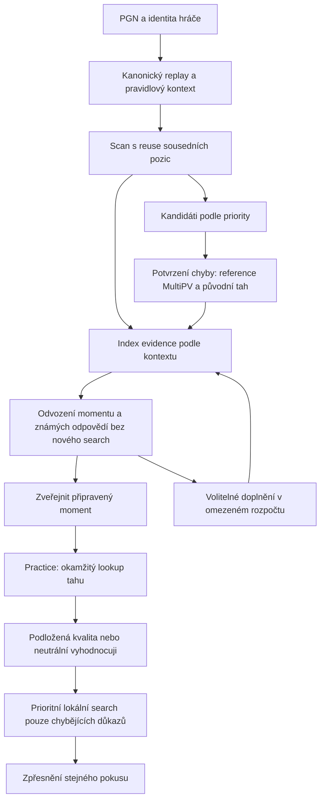

# Extraktor a Practice: cílová specifikace

Datum: 2026-09-06. Stav: specifikace k implementaci, nikoli popis nasazeného chování.
Základ ověřený v kódu: `e27f8324ed8350b9b156c4fe68c6ec05ef51ce3e`.
Implementační pořadí a release gates: [plán](extractor-practice-implementation-plan.md).

Tento dokument je cílová autorita pro další změnu. Nahrazuje konfliktní části
staršího `standard-analysis-extraction-design.md`: pevný cp strop správnosti,
lekci jako podmínku přijetí, přípravu odpovědí jako nové hledání od nuly a
společný stav kvality, tieru a zlepšení. Historické audity zůstávají historickými důkazy.

## 1. Co zamykáme

- Jedno jádro extrakce, stejný význam hodnocení na serveru, v browseru a na homepage.
- Jednotka Practice je jedno spolehlivě vyhodnotitelné rozhodnutí. Rozpoznání
  motivu ani ověřená dlouhá kombinace nejsou podmínkou.
- Potvrzení chyby současně připravuje odpovědi. Veškeré použitelné výsledky
  pro daný kontext vstupují do společného indexu evidence.
- Dobrá odpověď může být jiná než preferovaný tah enginu. Kvalita, přesný tier,
  pořadí a zlepšení oproti partii jsou samostatné údaje.
- Nepokrytý tah vyvolá okamžitou neutrální odezvu a cílený dopočet. Negativní
  značku smíme okamžitě ukázat jen s individuálním nebo skupinovým podkladem.
- Počet předpočítaných tahů nemá být pevná produktová podmínka. Úplné pokrytí
  není podmínkou přijetí momentu ani spuštění Practice.
- Nejasné 6./7. místo, velikost už jisté chyby ani tier dobré alternativy
  nesmějí vyvolat opětovné ověřování celé původní chyby.
- Nezavádíme nový režim schvalování, kompatibilitu se starými payloady ani rollout flags.

Algoritmus, stavy a význam polí níže jsou normativní. Uvedené číselné hodnoty
jsou konkrétní výchozí nastavení první implementace, ne naměřená optimální
kalibrace. Změna kvalitativních prahů vyžaduje novou `policyId`; ladění
rozpočtů novou `executionProfileId`. Není potřeba další abstraktní produktové
rozhodnutí před implementací. Nesplněný kvalitativní benchmark se nesmí řešit
tichým oslabením pravidel.

## 2. Tok od partie po odpověď



### 2.1 Replay a scan

Zachovat kanonický chess.js replay, history-aware identity, správnou stranu
na tahu i PGN s vlastní počáteční pozicí. `decisionPly` je index tahu v tomto
zdroji od nuly. Zdrojová identita nezávisí na evaluaci ani engine verzi.

Před enginem řešit povinné konce hry; možnost claimovat remízu není povinný
konec. Claim se modeluje samostatnou pravidlovou možností, nikoli vymyšleným
UCI tahem. Legální tahy v answer indexu obsahují jen skutečné tahy figur.
Vynucené rozhodnutí s jediným legálním tahem není nová osobní úloha.

Scan zachová nynější explicitní reuse sousedních pozic, zpravidla N+1 hledání.
Je zdrojem kandidátů a evidence, ne autoritou finální správnosti odpovědi.
Chybějící výsledek znamená neznámý kontext, nesmí přenést starou soupeřovu chybu.
Candidate key je zdroj + decisionPly; více důvodů téhož rozhodnutí se sloučí.

### 2.2 Potvrzení chyby

1. Načíst existující evidence daného kontextu. Označit, které závěry již podporují.
2. Chybějící referenci hledat MultiPV, výchozí K=5, nejvýše počet legálních tahů.
3. Původní tah explicitně ohodnotit ze stejného rootu s `rootMoves=[original]`,
   pokud již nemá dostatečnou kompatibilní evidenci z MultiPV.
4. Vyhodnotit původní tah proti referenci stejnou policy jako v Practice.
5. Přidat výpočet pouze při rozporu v přijetí momentu, nedostatečné síle,
   hraniční kvalitě původního tahu nebo nepodložené lepší alternativě.
6. Uložit použitelné výsledky všech průchodů do indexu, nikoli jen poslední MultiPV.

`CONFIRMED_MISTAKE` vyžaduje stabilní `BELOW_STANDARD` původního tahu a
alespoň jednu stabilní `GOOD` alternativu. Zařazení do feedu je samostatné
`selection=INCLUDED`, které navíc vyžaduje významný signál pro výběr.
`NOT_A_MISTAKE` znamená stabilně dobrou původní odpověď.
`UNRESOLVED` je nedostatek důkazů při limitu, nikoli prokázaná absence chyby.

Pro výběr preferovat doloženou ztrátu dostupného exact outcome, potom
stabilní expected-score ztrátu alespoň 0.08. Při skutečném CP_ONLY rámci lze
použít cp ztrátu alespoň 100, pokud reference není saturovaná (`abs(bestCp)<300`).
Scan smí být širší. Výsledky založené jen na velkém cp swing při zachování
saturovaného výsledku zůstanou v analýze s důvodem `SATURATED_CP_ONLY_SIGNAL`;
samotný swing je neposune do běžného feedu. Vyhraná/prohraná pozice není zákaz:
pokud má doloženou změnu rizika/výsledku podle výše uvedených signálů, může vstoupit.
Automatický název lekce ani materiální heuristika nejsou potřebný důkaz.

### 2.3 Odvození odpovědí

Po potvrzení provést čistou projekci z indexu: reference, původní tah, všechny
známé alternativy, jejich závěry a skutečné pokrytí. Tato operace nesmí volat engine.
Moment lze ihned emitovat. Vysvětlení a nepovinné doplnění mají nižší prioritu.

Rozlišit počet individuálně hodnocených tahů a počet tahů s podloženou kvalitou.
Skupinově pokrytý tah může mít jisté `BELOW_STANDARD` a žádné vlastní cp skóre.

### 2.4 Omezené doplnění pokrytí

Výchozí strategie nevynucuje výpočet všech dobrých tahů. Vezme již zaplacené
MultiPV a případně jeden další search omezený na dosud nevyřešené tahy,
s MultiPV nejvýše 3. Tím se znovu nepočítá již podložená reference ani
původní chyba a nový slabší průchod nepřepíše jejich důkazy. Rozšíření je dovoleno jen pokud:

- poslední kompletní MultiPV má stabilně podlimitní krajní tah, takže je
  naděje na levné zjištění hranice, nebo zbývají nejvýše tři neznámé tahy;
- zbývá volitelný rozpočet a žádná práce pro zahraný tah nečeká;
- neproběhl již jeden krok rozšíření pro tento root v této extrakci.

Pokud všech prvních pět tahů bezpečně zachovává kvalitu, jde o širokou množinu:
bez dalšího rozšiřování dokončit částečný index. Nehledat postupně dvacet odpovědí.
Pokud dvě poslední alternativy ještě čekají na stabilitu členství, nejdříve
využít jejich další dostupná pozorování, nikoli zvětšit MultiPV.

Pouhá kompletní top-K sada necertifikuje chybu všech ostatních. První verze
vytváří skupinové závěry pouze z pravidlové/exact evidence nebo ze skutečně
ohodnoceného celého scope. Současný `residualCoverage.ts` zůstane benchmarkový
experiment; není automatickou součástí produkčního toku. Jeho zapojení nesmí
být podmínkou rychlého Practice. Pro přenos cp horní meze na celý zbytek je
nutný scope certifikát, kompatibilní reference a policy, kterou tato mez
opravdu implikuje. WDL jednoho tahu nelze přisoudit ostatním.

## 3. Kvalita a míra jistoty

### 3.1 Jedna funkce, oddělené výstupy

`assessMove(frame, moveEvidence, policy)` vrací:

- `quality`: GOOD / BELOW_STANDARD / UNKNOWN;
- `qualitySupport`: SUPPORTED / PROVISIONAL / NONE;
- `tier`: BEST / STRONG / GOOD / SUBPAR nebo null, s vlastním support;
- metriky rozdílu proti referenci, každou samostatně dostupnou;
- vztah k původnímu tahu: SAME_MOVE / BETTER / EQUIVALENT / WORSE / UNKNOWN;
- úkoly, které zbývají: QUALITY / TIER / ORIGINAL_COMPARISON / EXPLANATION.

`IMPROVED` a `REPEATED_MISTAKE` nejsou kvalitativní tiery. Zlepšení může být
současně podstandardní; zopakovaný tah se určuje identitou tahu. Přesný label
blunder není nutný pro okamžité odmítnutí a tato změna nezavádí další taxonomii chyb.

### 3.2 Policy v4: výchozí přesná pravidla

Cp vždy normalizovat na trénující stranu. Pro cp referenci `b` a odpověď `m`:

```text
lossCp = b - m                     // záporná hodnota se nesmí tiše oříznout
toleranceCp(b) = max(100, min(300, 0.60 * max(0, b)))
cpQuality = lossCp <= toleranceCp(b)
E(wdl) = (win + 0.5 * draw) / (win + draw + loss)
lossE = E(reference) - E(move)
```

V rámci MATCHED_WDL je GOOD právě `cpQuality && lossE <= 0.10`.
V rámci CP_ONLY je GOOD právě `cpQuality`; výsledek výslovně uvádí CP_ONLY.
CP_ONLY nelze zvolit proto, aby se obešel existující rozporný WDL údaj.
Chybějící WDL během MATCHED_WDL hledání znamená čekání na chybějící důkaz.
Přepnutí modelu vytváří nový assessment frame, nikoli skrytou změnu pravidla.
V témže rámci a se stejnou podporou musí být klasifikace monotónní: tah
alespoň stejně dobrý v cp i E jako podporovaný GOOD nemůže být BELOW_STANDARD.
Rozpor cp proti E se neřeší pouhým pořadím MultiPV. Chybějící metrika může
závěr ponechat UNKNOWN, není dokladem horšího tahu.

WDL je skutečný výstup kompatibilního enginu ve stejném root kontextu.
`E` není lidská pravděpodobnost výhry. Žádný logistický převod cp se nevydává
za WDL. Cp a mate/TB se neporovnávají přes syntetické obří cp hodnoty.

| Příklad z pohledu hráče | Cp větev policy | Důsledek |
| --- | --- | --- |
| +0.2 → −1.3 | loss=150, tolerance=100 | Podstandardní; lepší než původní blunder na tom nic nemění. |
| +3.2 → +2.5 | loss=70, tolerance=192 | Může být GOOD; v MATCHED_WDL musí zachovat i E toleranci. |
| +4 → +2 | loss=200, tolerance=240 | Může být GOOD; není blokováno pevným 100/150 cp stropem. |
| +4 → −2 | loss=600, tolerance=240 | Podstandardní. |
| −4 → −20 | loss=1600, tolerance=100 | Podstandardní i při saturovaném WDL. |

Tyto příklady zamykají zamýšlené chování; neznáme-li jejich WDL, netvrdíme
výsledek kompletní MATCHED_WDL větve jen ze dvou cp čísel.

Uvnitř GOOD: BEST má lossCp <=20 a při WDL lossE <=0.02; STRONG má <=50 a
<=0.05; ostatní GOOD mají tier GOOD. `preferredMoveUci` je samostatně první
doložená engine volba; více tahů smí mít tier BEST. Podstandardní tah má
tier SUBPAR až po podložení tohoto závěru; jeho velikost chyby lze dál zpřesňovat.

Porovnání s původní chybou: identický UCI → SAME_MOVE; jinak rozdíl alespoň
50 cp nebo 0.05 E → BETTER/WORSE, pokud si dostupné metriky neodporují;
v opačných směrech UNKNOWN, v pásmu obou tolerancí EQUIVALENT.
Exact outcome má přednost. Toto porovnání nikdy neblokuje kvalitu odpovědi.

### 3.3 Exact a smíšené výsledky

Pravidlový terminální výsledek a kompletní, pravidlově kompatibilní tablebase
mají přesný outcome WIN > DRAW > LOSS. Zachování nejlepšího dosažitelného
outcome je GOOD, zhoršení BELOW_STANDARD. Vzdálenost matu/DTZ určuje preferenci,
nikoli automatické odmítnutí alternativní výhry. Respektovat 50/75 tahů a historii.

Mate skóre z konečného engine hledání má engine provenance a vyžaduje stabilitu;
není tablebase certifikát. Stabilně nalezené maty pro stejnou stranu podporují
zachování výhry. Smíšené cp/mate nebo nekompletní TB bez společného podkladu
jsou UNKNOWN a vyžadují cílené doplnění; neztrácet výhru jen změnou druhu skóre.

### 3.4 Stabilita bez zbytečného nového hledání

Nezavádět údaj „95% confidence“ bez kalibrace. Support je empirický závěr:

- validní legální root/PV, správný scope, perspektiva a context;
- alespoň dvě poslední kompatibilní kompletní observations při rozdílné hloubce
  (odstup alespoň dvě plies), nebo dva dokončené průchody s rostoucím budgetem;
- shodné členství v kvalitativní množině; nemusí se shodovat tier ani pořadí;
- závěr přežije interval min/max pozorovaných cp rozšířený o 20 cp na obou
  stranách; pro E obdobně ±0.02, oříznuté na [0,1]. Policy se vyhodnotí přes
  krajní kombinace intervalů reference a tahu včetně proměnné toleranceCp(b);
- pro přijetí momentu je alespoň poslední reference a původní tah z hledání
  na potvrzovacím budgetu profilu. Scan nebo malý lokální search tento gate nenahradí.

Policy `practice-v4-2026-09-07-verified-reference` vyžaduje `minimumSupportNodes=25000`
a `latestSupportNodes=100000`: starší bod každé konvergenční dvojice reference
i posuzovaného tahu musí sám hlásit alespoň 25 000 nodes, novější alespoň
100 000 nodes. Jejich fyzická hledání musí mít alespoň odpovídající skutečně
vykázaný počet nodes. Requested budget tuto podmínku nenahrazuje; pozdější
práce nesmí zpětně povýšit mělký bod na zralý důkaz. Asymetrie ponechává
použitelný starší bod při skoku nejnovější iterace z desítek na stovky tisíc
uzlů. Kalibrace vychází z nezávislých first-choice hledání: chybné GOOD
přežilo dvojice 36 424→41 083 a 27 063→48 882 nodes, zatímco podmínka obou
bodů nad 100 000 zbytečně blokovala pozdější správný závěr. Minimum 100 000
pro novější bod je existující krok výpočetního budgetu s rezervou nad těmito
chybnými průběhy; není důkazem obecné bezchybnosti.
Konečné CP/WDL hodnocení jiného tahu než reference navíc vyžaduje
`minimumCompletedSupportingSearches=2`: dva odlišné fyzické search records
se stavem COMPLETED. Každý musí samostatně mít vlastní konvergenční dvojici
25k/100k, platné členství tahu v posledním úplném bundle a kompatibilní bounds;
Pozitivní proof tvoří dvě bezprostředně sousedící relevantní fyzické skupiny,
obě dokončené a samostatně vyzrálé. Za nimi může být mladší neukončený nebo
nezralý suffix pouze jako counterevidence: všechny jeho uchované body, celý
interval a bounds musí podporovat tentýž závěr proti aktuální READY referenci.
Takový suffix nepřidává hlas a samotná nedokončenost neruší dříve zaplacenou
koherentní kvalitu. První způsobilá skupina od konce a její bezprostřední
předchůdce musí být oba podpůrní; nelze přeskočit mezilehlý STOPPED, UNKNOWN
nebo opačný dokončený výsledek a spojit nesousedící hlasy. Způsobilost se
určuje dokončeností a maturitou, nikdy požadovanou kvalitou. Nový tah bez
obou pozitivních groups zůstává UNKNOWN. Každý suffix point/bound ID se cituje
v závěru a ovlivňuje jeho provenance. Cache hit, opakovaný snapshot ani dva body jednoho
hledání nepřidávají druhý hlas. Globální novější counterevidence a reference
drift zůstávají veto; starší hlasy se hodnotí proti současné referenci.
Self-reference GOOD vyžaduje úplnou aktuální reference readiness popsanou v §4;
konzistentní symbolické MATE a RULE/TABLEBASE zachovávají vlastní důkazní podmínky. Jde o empirické potvrzení konečného odhadu, nikoli
matematickou záruku či statisticky nezávislé hlasy. Nová kalibrace reaguje také
na falešně předpočítaný tah z jediného 200k root hledání; runtime-only prodleva
by tento problém neřešila. Globální budgety a hranice kvality se nemění.
Podmínka maturity 25k/100k platí také pro podporu originalRelation a pro
ověřené OPPONENT pokračování, nikoli pro nezávisle ověřené RULE/TABLEBASE
výsledky. Nové potvrzení dvěma hledáními se týká konečné quality jiného tahu
než reference; nemění samostatné originalRelation. Konečná volba OPPONENT root tahu
také vyžaduje společnou aktuální reference readiness.
Úzká výjimka z obou node floors platí pro dvojici symbolických ENGINE/MATE
bodů se shodným vítězem: vyřešené matové hledání může přirozeně skončit
hluboko pod 25 000 nodes i při větším budgetu.
Dvojice nadále musí splnit kompletnost, aktuální bundle/scope, konvergenci,
slučitelné meze a shodu domény. Zůstává ENGINE predikcí matu, nikoli RULE
certifikátem; CP ani WDL body tuto výjimku nemají.

Tah musí být stále přítomen v posledním platném kompletním bodovém bundle
téhož fyzického search, jinak jeho staré observations nesmějí být použity
jako konvergenční důkaz. To nezakazuje reuse silné alternativy z jiného search.
Staré body zůstávají diagnostikou a protipříklady; nezralé novější body i
směrové meze stále mohou vyřadit starší podporu. Hranice GOOD, CP ani WDL
se touto změnou nemění. Jde o minimální zralost měření, nikoli záruku správnosti
konečného hodnocení enginu; musí projít novým porovnávacím auditem.

Dvě observations jednoho search jsou dvě pozorování konvergence, nikoli dvě
nezávislá měření. Cache hit zachová search ID a snapshot ID, nepřidá hlas.
Pokud tah je přímo referencí téže observation, jeho loss je identicky nula;
nelze z něj intervalovým výpočtem vytvořit dva nezávislé různé výsledky.
Pokud protokol potřebné kompletní snapshots nedodá, doplnit cílený search.
Na hranici při stropu zůstane UNKNOWN; nevymýšlet jistotu jen proto, že došel čas.

Novější směrové meze se uchovají jako `bundleComplete:false` counterevidence.
Neposkytují bodové skóre, WDL ani další hlas pro konvergenci. Mez odporující
intervalu starých bodových pozorování jejich support vyřadí; slučitelná mez
jej sama neruší. Nové kompletní bodové pozorování stejného tahu nahradí jeho
starší průběžné meze. Cache nesmí za nové pozorování vydat starý slot jiné PV
nebo starší hloubky. Skupinový závěr se ověřuje i proti aktuální kompatibilní
evidenci, nikoli pouze proti vybraným historickým ID svého původního důkazu.

Prozatímní trend může proudit do evaluace v UI, ale neukončuje pokus jako
chybný/správný. Stejný mechanismus podpory používají extrakce i lokální grading;
profil se liší rozpočtem, ne významem GOOD. Stabilní rychlý lokální výsledek
zůstává označený jako osobní client evidence, ne kanonický serverový důkaz.

## 4. Evidence, reuse a reference

`PositionAnalysisPool` je in-memory index v rámci běhu/session. Není nový
externí cache systém. Klíč kontextu obsahuje FEN, pravidlově relevantní historii,
pravidla a stranu; engine fingerprint obsahuje build/NNUE/options/WDL model.
Policy patří k odvozeným assessmentům, nikoli k identitě fyzického search.

Každé hledání přidá své kompletní root observations. Držet poslední tři
kompletní snapshots a evidence použité v některém assessmentu; neukládat každou
streamovanou info řádku. Novější údaj nesmí bez důvodu smazat jiné známé tahy.
Protipříklad platného novějšího search ale musí zneplatnit odpovídající support.

Reuse má tři oddělené významy:

1. převzetí již hotového podporovaného závěru;
2. využití existujících observations pro nové porovnání;
3. zachování interní engine transpoziční tabulky mezi souvisejícími search.

Krok 3 již funguje v obou adaptérech. Nenahrazuje kroky 1 a 2. Větší počet
nodes sám nedokazuje, že MultiPV a singleton search mají stejnou přesnost.
`purpose` je auditní důvod, nikoli zákaz reuse mezi fázemi.

`ComparisonFrame` váže kontext, engine/model, referenční assessment a policy.
Individuální metriky lze znovu odvodit jen z kompatibilních observations.
Kompatibilita vyžaduje shodný context/history, engine fingerprint, WDL model,
POV a druh porovnatelného skóre; posuzovaný tah patří do doloženého root scope.
Rozdílné MultiPV/rootMoves/budget nevylučují převzetí dat, ale samy nezakládají
stejnou sílu: support se vždy znovu odvodí podle §3.4 a role search. Změna
purpose nezneplatňuje platná data a elapsed wall time sám není invalidace.
Serverové hodnocení lze hned zobrazit v browseru, ale nové slabé lokální skóre
se nesmí slepě odečíst od serverové reference. Při nekompatibilním runtime
vytvořit jednou lokální referenci; pak ji znovu používat pro další tahy.

Reference není pouhý název bestmove. Prohození rovnocenných tahů nemá spustit
plnou reanalýzu. Pokud nový tah/reference překoná tolerované rozpětí nebo změní
outcome, označit starý frame za superseded a znovu odvodit dotčené assessmenty
z poolu. Dopočítat pouze chybějící oporu. Neignorovat zápornou loss pomocí max(0,...).

Každé nové hledání musí mít jeden důvod: SCAN / MISSING_REFERENCE /
VERIFY_REFERENCE / MISSING_MOVE / UNSTABLE_QUALITY / REFERENCE_DRIFT / OPTIONAL_COVERAGE /
CONTINUATION. Změna fáze sama není důvod. Pool musí přežít checkpoint v omezené
serializované podobě; obnovení nepředstírá zachovanou fyzickou engine session/TT.

### 4.1 Ověřená aktuální reference

Každé konečné CP/WDL porovnání včetně self-reference GOOD a automatické
OPPONENT volby vyžaduje současně aktuální dokončenou full-root volbu a
odlišný dokončený focused singleton aktuálního preferovaného tahu s
`minimumReferenceProbeNodes=400000` skutečně vykázanými nodes. Probe musí
mít vlastní vyzrálou dvojici 25k/100k, aktuální členství v posledním kompletním
bundle, stejné artifact/model/context a kompatibilní bounds. Počet rootů
není gate: koherentní root200k + selected400k postačuje. Reason
VERIFY_REFERENCE označuje účel nové práce; stejně silné již placené hledání
původního nebo referenčního tahu se převezme bez opakování.

Pozitivní witness je nejnovější způsobilý dokončený probe. Novější koherentní
levnější nebo STOPPED detail sám jeho platnost neruší. Veškerá současná
kompatibilní bodová a směrová counterevidence však musí zůstat kontrolována;
nelze přeskočit nový rozpor a oživit starý souhlas. Aktuální full-root a probe
musí podpořit GOOD v celém intervalu, nikoli jen souhlasit v posledním bodě.
Změna hodnoty vybraného tahu v obou směrech přes stávající 40cp nebo .04E
observation margins je reference value drift. Nemění hranici GOOD/BELOW.
Všechny závislé assessments při neověřené referenci vracejí UNKNOWN a citují
jak pozitivní důkazy, tak counterevidence; CLIENT provenance se neztrácí.

Sdílený prepared evaluator vrací referenceReadiness se stavem READY /
MISSING_ROOT / MISSING_REFERENCE_PROBE / REFERENCE_VALUE_DRIFT /
UNRESOLVED_REFERENCE, physical root/probe ID, evidence/counter ID a
requiredWork ROOT / REFERENCE_PROBE / null. Novější nekoherentní probe
vyžaduje root refresh. Pokud je nekoherentní probe starší než nová root
premisa, další krok ověří vybraný tah; novější root sám starý rozpor nemaže.
Po každém hledání se určí právě jedna další závislost. Kvalitativně stejné
alternativy a tier nejistota nejsou samostatným důvodem opakovat práci.

Symbolické stabilní ENGINE/MATE zachovává skutečnou konvergenci, current
membership, outcome a bound veto bez 400k minima; RULE/TABLEBASE zůstává
nezávislým přesným důkazem. OPPONENT porovnává hodnoty z pohledu skutečné
strany na tahu, ale zachovává původní trainingSide/history binding kontextu.
Jeden legální tah nezakládá dva fyzické witnesses jen shodou scope.
VERIFIED_BRANCHES nadále vyžaduje pro automatickou OPPONENT hranu engine
root evidence (včetně symbolické MATE výjimky). Samostatná RULE-only opponent
hrana není implementovaná schopnost; RULE root/USER terminal paths zůstávají
podporované. Defaultní producer vytváří SINGLE_DECISION.

400k je kalibrační kandidát reagující na skutečné optimistické reference
z auditů 11/16/20/59, nikoli prokázaná obecná bezchybnost. Case59 zůstal
optimistický po selected200k a změnil hodnotu po selected400k; case16 ani
800k nezjistil konečný hlubší odhad, ale readiness správně zůstala nevyřešená.
Celkové node/wall limity se nezvyšují; při jejich vyčerpání moment/odpověď
zůstává nevyřešená. Úspěch vyžaduje nový úplný empirický audit.

## 5. Datový kontrakt v4

Níže je normativní logický kontrakt. JSON schéma a runtime validátory vzniknou
z jednoho sdíleného zdroje. V transportu nejsou Date/Map/undefined; nullable
metrika je null, nikoli nula. UCI pole jsou kanonická, unikátní a legální.
ID jsou neprázdné řetězce, times ISO-8601, node counts nezáporná celá čísla,
cp konečná čísla, WDL nezáporné s kladným součtem. Všechna níže uvedená pole
jsou povinná kromě výslovně nullable hodnot.

| Entita | Pole a význam |
| --- | --- |
| `SourceDecision` | `gameId`, `sourcePgnHash`, `decisionPly`, `contextId`, `fen`, `positionHistory`, `trainingSide`, `originalMoveUci`. Immutable zdroj; identita momentu zůstává game/hash/ply. |
| `AnalysisObservation` | `id`, `searchId`, `snapshotIndex`, `contextId`, `engineFingerprint`, `rootScopeUci`, `requestedMultiPv`, `completedSlots`, `bundleComplete`, `depth`, `nodes`, `elapsedMs`, `lines`. Každá line: UCI, explicitní score POV/kind, `bound` UNBOUNDED / UPPER / LOWER, nullable WDL, legální PV. `bundleComplete` znamená kompletní požadované MultiPV sloty v dané hloubce; neohodnocuje nevrácené tahy a není scope upper-bound certifikát. |
| `SearchRecord` | `id`, `contextId`, `sequence`, `engineIdentity`, `sessionId`, `request`, `reason`, `reportedNodes`, `reportedTimeMs`, `completion`, `observationIds`. `sequence` zachovává skutečné pořadí fyzických hledání i po uložení do JSONB. `completion`: COMPLETED / STOPPED / FAILED. Request obsahuje přesný scope, historii a limit. Reuse je odkaz na toto ID. |
| `ComparisonFrame` | `id`, `contextId`, `policyId`, `engineFingerprint`, `model` (MATCHED_WDL / CP_ONLY / EXACT_OUTCOME), `referenceAssessmentId`, `status` (CURRENT / SUPERSEDED), `supersededById` nullable. |
| `MoveAssessment` | `id`, `contextId`, `moveUci`, `frameId`, `quality`, `qualitySupport`, nullable `tier`, `tierSupport`, nullable `score`, `metrics`, `originalRelation`, `observationIds`, `source` (SERVER_ENGINE / CLIENT_ENGINE / RULE / TABLEBASE), `pending`. Metrics: nullable `lossCp`, `lossExpectedScore`, `recoveredCp`, `recoveredExpectedScore`, `preservesExactOutcome`. |
| `CoverageGroup` | `id`, `contextId`, `frameId`, `movesUci`, `conclusion=BELOW_STANDARD`, `basis` (EXACT_OUTCOME / ALL_SCOPE_ASSESSED / CP_SCOPE_UPPER_BOUND), `evidenceIds`. Poslední basis smí vytvořit jen validátor podporovaného scope certifikátu, v první produkční verzi není engine producer. |
| `AnswerIndex` | `contextId`, `frameId`, `legalMovesUci`, `assessmentIds`, `coverageGroupIds`, `preferredMoveUci`, `unresolvedMovesUci`, `readiness` (PARTIAL / ALL_MOVES_CLASSIFIED). Readiness se odvozuje, není autoritou sama o sobě. |
| `DecisionAssessment` | `status`, `reason`, `originalAssessmentId`, `referenceAssessmentId`, `selection`, `selectionReason`, `selectionSignal`, `evidenceIds`. Statusy z §2.2; selection INCLUDED / OMITTED; signal EXACT_OUTCOME_LOSS / EXPECTED_SCORE_LOSS / NON_SATURATED_CP_LOSS / NONE. Practice prompt vyžaduje CONFIRMED_MISTAKE a INCLUDED. |
| `PracticeMomentRevision` | `contractVersion=4`, `momentId`, `revisionId`, `semanticHash`, `source`, `policyId`, `policySnapshot`, `executionProfileId`, `executionProfileSnapshot` (`id`, `minimumConfirmationNodes`), `generatorVersion`, `decision`, `rootAnswerIndex`, `continuation`, `frames`, `assessments`, `coverageGroups`, `evidence`. Immutable referenčně uzavřený payload. |
| `Continuation` | `mode` (SINGLE_DECISION / VERIFIED_BRANCHES), `explanationLines`, `nodes`, `edges`. Explanation line obsahuje startContextId, UCI posloupnost a stop reason. Nodes mají context/history/role a nullable vlastní AnswerIndex; edge from/to/UCI. Nepřipravený USER node není hratelný. |
| `AnalysisReceipt` | source hash, mode, profile ID, seznam user decisions s výsledkem scan/confirmation/selection, přesné failure/stop reasons, completeness, search cost counters. FIRST_PUZZLE nikdy není full-game completion. |

`evidence` je normalizovaný slovník SearchRecord/AnalysisObservation/exact
records podle ID. Tentýž search/PV se nekopíruje do každého tahu a větve.
Cache a deduplikace pracují s kontextem a verzí; nepředpokládají, že stejné
FEN znamená stejný historický stav.

### 5.1 Invarianty validátoru

1. Každý odkaz se vyřeší v dodané revision nebo v explicitní příloze evidence.
2. Root source, original move, engine scope, reference i replay history souhlasí.
3. SUPPORT nelze prohlásit jen klientským booleanem; validátor zkontroluje
   strukturální podklady a znovu odvodí závěr společnou policy.
4. Kvalita nesmí být odvozena z pořadí, počtu PV nebo absence tahu.
5. GOOD podporované v jednom rámci se nesmí současně překrývat s platnou
   BELOW_STANDARD coverage group. Rozpor způsobí neplatnost/obnovu frame.
6. `ALL_MOVES_CLASSIFIED` právě když každý legální tah má podporovaný
   individuální či skupinový závěr. Přesné tiery ani vlastní skóre všech tahů nepotřebuje.
7. `unresolvedMovesUci` je přesný doplněk podporovaných klasifikací. Provisional
   assessment není vyřešený tah. PARTIAL neznamená, že všechny neznámé tahy jsou špatně.
8. Rules/TB evidence a engine mate zůstávají odlišené. `preservesExactOutcome`
   u podpořeného porovnání dvou engine mate skóre označuje zachování
   predikovaného vítěze; zdroj stále zůstává ENGINE. Ztráta tohoto výsledku
   poskytuje selection signal EXACT_OUTCOME_LOSS, bez syntetických cp. Scope upper/lower bound
   se nikdy nesmí zaměnit za individuální exact score.
9. Semantic hash zahrnuje policy snapshot, obsah závěrů, jejich support,
   referenční metriky a význam continuation; fyzické search ID a čas nesmějí
   samy vytvářet sémantickou změnu. Plná provenance se uchová zvlášť.

### 5.2 Persistence a API

Zachovat identitu TrainingMoment a immutable SolutionRevision. Nový kontrakt
nahradí staré JSON tvary a redundantní closed-set autority (`acceptedMovesUci`,
`acceptanceFrontier`, univerzální verificationStatus). Seznam dobrých tahů
se odvozuje z AnswerIndex; není druhým zdrojem pravdy. Runtime typy,
constructor, hash, validační schéma a DTO musí sdílet tutéž definici.

Stávající feed/moment endpointy vracejí prompt s kompaktním manifestem v4:
source, revision/policy, root index, potřebné frames/assessments/coverage a
kompaktní podpůrná evidence. Plná auditní telemetry není součást každého feed
itemu. Potřebné grading podklady se ale nesmějí načítat až po zahrání tahu.
Vysvětlení může přijít jako samostatný review payload.

Každý zahraný tah je událost `AttemptMove` s `clientAttemptId`, `stepIndex`,
`momentRevisionId`, `contextId`, `moveUci`, `playedAt`, `initialAssessmentId`
nullable, `initialCoverageGroupId` nullable (nejvýše jeden z těchto dvou odkazů) a `resolution` PENDING / RESOLVED / UNAVAILABLE. Uložit jej lze i
před finální kvalitou. Odhalení řešení je samostatný konec pokusu, nikoli tah.

Zpřesnění je `AttemptAssessment` s `eventId`, stejným clientAttemptId/stepIndex,
`sequence`, `supersedesEventId` nullable, `frameId`, assessmentem a přílohou
evidence. Unique eventId a pokus+step brání duplicitám. Opakování stejného eventu
je idempotentní; stejná sequence s jiným obsahem je konflikt. Doručené starší
zpřesnění nepřepíše novější. ENRICH doručené před RECORD vrací retryable
missing-parent; offline outbox drží tuto závislost.

Server ověří vlastníka, revision/context, legalitu, scope a policy a přepočítá
deklarovaný závěr. Osobní client evidence není kryptografická engine attestation
a nesmí změnit kanonické odpovědi veřejného puzzle. Live UI samples se neposílají
do DB; ukládají se podporované assessmenty a explicitní opravy.

Aktualizace výpočtu je stále jeden pokus. PENDING/UNAVAILABLE nemění mastery ani
streak. Podporovaná quality může vyřešit pokus bez finálního tieru; zpřesnění
nezapočte další úspěch. Při opravě se agregáty znovu odvodí z posledního platného
assessmentu téže události. Scheduler musí umět pracovat s quality, ne vyžadovat
historický enum míchající tier a zlepšení.

Reanalýza celého zdroje je výslovně spuštěná nová extrakce (nebo retry/resume
nedokončeného běhu), ne otevření puzzle či neznámý tah. V cílovém systému nové
evidence vytvoří revision; již existující pokusy zůstávají připnuté ke své
revision. To není požadavek na zachování dnešního pre-user formátu při migraci.
Diagnostický `decisionOutcomes` sám nearchivuje ani nezneplatňuje uložený moment.
Takovou změnu musí doložit validovaná kanonická revision; rozporný diagnostický
status pro stejný ply se odmítne před zápisem.

Server i browser načtou pro tento účet, partii a přesný PGN hash dosavadní
nearchivované decision plies. FULL_GAME je prověří i pod prahovým signálem
nového scanu; checkpoint tento seznam zmrazí. Hints pouze vybírají práci,
nenahrazují důkaz. Výstup vedle trénovatelných momentů přenese kanonickou
negativní revision těchto rozhodnutí; ta se nezapočítá jako nové cvičení.
FIRST_PUZZLE tato reassessment hints nepoužívá.

Výsledek extrakce nese `engineWork` za celý běh včetně obnovených checkpointů.
Per-game receipt má verzi 2 a vlastní `engineWork` jen za danou partii. Náklady
počítají fyzické search ID, nikoli jednotlivé snapshoty; evidují požadované
a reportované uzly/čas, reuse, selhání a důvody. Selhání bez fyzické evidence
má oddělený počet a požadovaný rozpočet, nevymyšlenou skutečnou spotřebu.
Odebrání starého kontextu z paměťového poolu nesmí odebrat jeho náklady.

## 6. Practice runtime

| Událost / znalost | Ihned | Následná práce |
| --- | --- | --- |
| Známé GOOD | pozitivní značka; přesný tier jen pokud podložený | případně tier/vysvětlení |
| Známé BELOW_STANDARD | obecná subpar značka | loss/tier/porovnání lze dopočítat |
| Skupinové BELOW_STANDARD | stejná obecná značka, žádné vymyšlené cp | individuální search pro závažnost |
| Pouze provisional nebo neznámé | tah na desce + neutrální „Vyhodnocuji“ | prioritní search, případně live eval |
| Nelegální tah | běžné odmítnutí tahu deskou | žádný engine a žádný AttemptMove |
| Engine timeout/failure | ponechat již podložený závěr; jinak neutrální review | UNAVAILABLE, žádná falešná chyba |

U neznámého tahu se neutrální stav musí vykreslit před náročnou projekcí evidence.
Pouhé nastavení React state před synchronním výpočtem není splnění okamžité odezvy.

Při otevření aktivního puzzle prewarmnout engine a hydratovat kompatibilní pool.
Spustit nejvýše jedno volitelné doplnění, pokud tab není skrytý a nečeká uživatelský
tah. Po odejití engine uvolnit/pozastavit podle session lifecycle. Neprohřívat
všechny feed položky. Stejnou session použít při homepage přechodu do puzzle.

Fronta: SUBMITTED_QUALITY > REQUIRED_REFERENCE > SUBMITTED_DETAIL > OPEN_WARMUP
> OPTIONAL_COVERAGE > EXPLANATION. Priorita se týká celého požadavku včetně jeho
nutných závislostí. Při zahrání tahu zastavit volitelný search a zachovat validní
kompletní snapshots. Každá úloha nese session generation/context/frame/attempt ID;
pozdní callback nesmí přepsat jiné puzzle ani zastavit jeho engine.

Lokální algoritmus:

1. Lookup individuálního assessmentu a coverage group; hned emitovat první stav.
   Před vytvořením enginu zkontrolovat terminální výsledek zahraného tahu.
   Pravidlově doložená výhra může sama doložit nejlepší dosažitelný outcome;
   remíza/prohra vyžaduje kompatibilní exact referenci. Použít stejný evaluator
   a validovatelný osobní RULE patch, nevytvářet druhý grader.
2. Chybí-li quality, najít kompatibilní referenci v poolu. Pokud není, vytvořit
   lokální root referenci jednou, MultiPV=1; uložené varianty jsou užitečné kandidáty.
3. Vyhodnotit pouze zahraný rootMove; používat již vznikající snapshots pro trend
   a support. Při zjištěné změně reference ji cíleně ověřit.
4. Jakmile je podložená quality, emitovat ji a ukončit blokující práci.
5. Původní tah z partie znovu hledat jen tehdy, když uživatel potřebuje jeho
   porovnání a nelze je odvodit z kompatibilních dat. Není závislost kroku 4.
6. Při dalším tahu v témže kontextu znovu použít referenci a známé assessmenty.

Live eval vždy označuje průběžný odhad se stejnou perspektivou. Stream throttle
100 ms; vlastní značku kvality měnit jen podporovanými assessmenty, případnou
pozdější korekci ukázat otevřeně. Při offline nefunkčním enginu použít známé
hodnocení nebo neutrální review; server fallback není povinná součást této verze.

## 7. Režimy, rozpočty a pokračování

`FULL_GAME`: celý scan a zpracování všech kandidátů profilu, přesný receipt
i při nedořešení. `FIRST_PUZZLE`: stejný scan jedné hry, pořadí kandidátů,
konec po prvním připraveném root momentu; starší hra až po vyčerpání vhodných
kandidátů. Žádný rescan kvůli neúspěšnému prvnímu kandidátovi.

Homepage nečeká na coverage ani rozbor. Sdílí grading/session kontrakt.
Public/Master používá stejnou extrakci; případné požadavky soutěžního produktu
jsou publication gate nad výsledkem, ne jiná definice dobrého tahu. Neúplný
moment se nesmí omylem publikovat do spotřebitele vyžadujícího uzavřenou sadu.

| Práce | Výchozí limit první implementace |
| --- | --- |
| Scan a potvrzení | Zachovat současné profile-specific nodes a geometrický cap; tato změna je plošně nezvyšuje. |
| Extra coverage během FULL_GAME | Součet fyzických nodes nejvýše min(100k, 20 % již spotřebovaných confirmation nodes tohoto momentu); nejvýše jeden search. |
| Extra coverage před FIRST_PUZZLE emit | 0; případné doplnění až po zobrazení. |
| Volitelná práce při otevření | Nejvýše jeden 50k search a 250 ms aktivního search; pomalý startup se měří zvlášť. |
| Lokální quality | Postupné search limity 100k / 200k / 400k / 800k; spouštět jen chybějící kroky a pouze pokud zbývá celý rozpočet průchodu. |
| Součet blokující lokální práce | Nejvýše 1.5M requested nodes a 8 s wall time včetně čekání/startupu/retry; první vyčerpaný limit vítězí. |
| Retry runtime failure | Nejvýše jednou a uvnitř stejného celkového limitu; budget se neresetuje. |
| Nepovinný detail po quality | Nejvýše 200k nodes / 2 s; zrušit při dalším rozhodnutí. |

Jde o limity spotřeby, nikoli tvrzení, že jeden 100k průchod stačí na správnou odpověď. S kompatibilní placenou referencí lze využít celou řadu 100k + 200k + 400k + 800k = 1.5M; nová reference nebo retry spotřebovávají stejný celkový rozpočet a mohou poslední průchod vyloučit. Jediný optional coverage průchod může předplatit první vyzrálý důkaz pro pozdější odpověď; dosud neviděný CP/WDL tah po něm nezíská automaticky definitivní kvalitu.
Při každém dispatch odečíst rezervovaný limit z celkového zůstatku; counter
reportovaných nodes navíc slouží měření. Restart/prohloubení UCI search není
pokračování stejného node counteru a účtuje se samostatně.

Default SINGLE_DECISION končí po jednom uživatelském rozhodnutí. Explanation
PV je legální rozbor, ne ověřená kombinace. VERIFIED_BRANCHES lze nabídnout jen
pro explicitně připravené USER uzly s vlastní referencí/answer indexem a
podporovanými soupeřovými přechody. Jiná dobrá alternativa jde do své větve
nebo do review. Nikdy se násilně nepřipojí do cizí PV. Limit dvou plies není
důkaz dokončené kombinace; tato změna nevyžaduje nový detektor kombinací.

## 8. Co bude znamenat hotovo

- Známá odpověď dostane pravdivou okamžitou odezvu bez engine search.
- Neznámá odpověď dostane okamžitý pending stav a prioritní omezený výpočet.
- Stabilita tieru a porovnání s partií nebrzdí kvalitu.
- Předání confirmation → root index má nula nových fyzických search.
- Žádný tah není chybný jen kvůli absenci z top-K.
- Žádná fáze bezdůvodně nepočítá referenci/původní tah znovu.
- Jeden tah vytváří jeden pokus včetně offline retry a pozdější opravy.
- Evidence jde vysledovat přes API, persistenci, homepage, browser i server.
- Kvalitativní a výkonové gates z implementačního plánu projdou; PARTIAL podíl
  sám o sobě není selhání ani důkaz dobrého UX.
