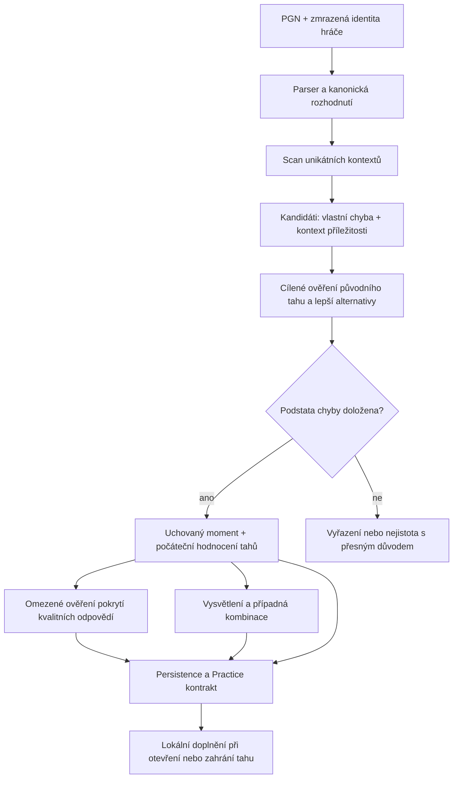

# Návrh extrakce osobních tréninkových momentů

Stav: technický návrh k implementaci, 2026-09-05. Vychází z auditu revize
`873912414c5498fa1c94e575ed9847884cad190b` a následného produktového upřesnění.
Dokument zachovává historický návrh; implementaci nyní popisují
`standard-analysis-implementation.md` a `homepage-extractor-integration-verification.md`. Schválené principy jsou
v [produktovém směru](audits/standard-analysis-product-direction.md), důkazy
současných problémů v [auditu](audits/standard-analysis-audit.md).

## 1. Cíl a hlavní rozhodnutí

Extraktor má z hráčových partií uchovat spolehlivě doložené chyby s lepšími
alternativami, které mají výukovou hodnotu. Nemá vyžadovat neměnné hodnocení
každého legálního tahu ani hotovou kombinaci pro všechny alternativy.

Oddělíme tři otázky:

1. **Moment:** udělal hráč doloženou chybu a máme doloženou lepší možnost?
2. **Pokrytí odpovědí:** které tahy umíme hned ohodnotit; víme o zbytku alespoň,
   že je pod kvalitativní hranicí?
3. **Pokračování:** co umíme vysvětlit nebo dále zadat jako ověřenou úlohu?

Změna GOOD→STRONG, prohození stejně dobrých tahů ani nejasná vzdálenější
alternativa nesmí sama rušit první výsledek. Rozpor v tom, zda původní tah je
chyba nebo zda existuje lepší možnost, první výsledek ovlivnit musí.

Pro tento návrh již není nutné další produktové schválení. Konkrétní číselné
prahy, rozpočty a algoritmus ověření pokrytí jsou návrhy k měření, nikoli
uživatelem schválené či experimentálně prokázané konstanty. Binární úspěch,
odměny a animace nejsou součástí vstupních podmínek extrakce.

## 2. Tok od partie k momentům

### Fáze A — jednou vytvořit zdrojový kontext

PGN parsovat právě jednou. Pro každý tah uchovat FEN před/po tahu, jeho UCI,
barvu, movetext index a historii potřebnou pro pravidlový výsledek. Používat
parserem ověřené `Move.before/after`, nikoli vlastní regex FEN hlaviček nebo
paritu indexu. White/Black určovat ze zmrazené importní identity a pozice.

Kanonický `decisionPly` je index od nuly i u PGN začínajícího například tahem
černého v 37. tahu. Pozice nese rošádu, en passant, hodiny a history context.
Chybný zdroj je explicitní chyba importu/replay, nikdy tichý návrat do základního
postavení. Rozhodnutí s jediným legálním tahem nepovažovat za příležitost volby.

Před každým engine hledáním řešit pravidlově terminální stav. Rozlišit mat,
pat a pravidlové remízy včetně potřebné historie a claim semantics. Tablebase
je samostatný typ evidence; ne převod na vymyšlené cp. Po posledním matujícím
tahu lze analýzu normálně dokončit bez PV neexistujícího dalšího tahu.

### Fáze B — levný společný scan

Plná analýza projde obě barvy, aby měla hodnocení partie i kontext soupeřových
chyb. Při stejném rozpočtu explicitně převezme hodnocení pozice po tahu jako
hodnocení před dalším tahem. U N tahů to znamená zpravidla N+1 kontextů místo
2N požadavků; přesný počet ovlivní pravidlové konce a dostupnost evidence.

Reuse je rozhodnutí společné orchestrace, ne náhodný rozdíl browser cache
oproti serveru. Klíč zahrnuje engine, profil, pozici a pravidlovou historii.
Výsledek z odlišného historického kontextu nelze slepě ztotožnit podle FEN.

Scan není finální grading. Má široce zachytit podezřelá rozhodnutí: ztrátu
expected score, cp zhoršení, ztrátu doloženého exact outcome a praktický motiv
i v nasycených vyhraných/prohraných pozicích. Použít sjednocení těchto signálů,
ne skrytý WDL filtr, který automaticky zavře ostatní možnosti. Velká cp ztráta
sama zatím neznamená přijetí finálního momentu.

Na každé uživatelovo rozhodnutí založit jeden záznam; `MY_MISTAKE` a
`MISSED_OPPORTUNITY` budou metadata stejného rozhodnutí. Soupeřova chyba může
zvýšit jeho prioritu a vysvětlit příležitost. Nemá vytvářet druhou nezávislou
cestu, která vlastní další ply, duplikuje ověřování nebo potlačí jeho analýzu.

### Fáze C — kandidáti a pořadí práce

Kandidát nese original/best evidence, závažnost, zdroj signálu a priority.
Prioritizovat ztrátu výhody, záchranu remízy a konkrétní taktickou příležitost.
U stejné chyby více signálů sloučit; nepočítat je jako více momentů.

Plná analýza musí nakonec zpracovat všechny kandidáty vybraného profilu nebo
jejich nedořešení uvést v receipt. Homepage smí skončit po prvním vhodném
momentu a používá vlastní pořadí/rozpočet. Nevytváří full-game completion.

Pozdější výběr do feedu může omezovat blízké opakování stejného motivu v jedné
partii; nemá kvůli tomu mazat důkazy, že se tato rozhodnutí skutečně stala.

### Fáze D — potvrdit podstatu chyby

Nejdůležitější porovnání je **původní tah versus věrohodná lepší alternativa
ze stejného rozhodnutí**. Původní tah musí být vyhodnocen explicitně, i když
není v prvních MultiPV řádcích.

Preferovaný směr pro experiment: root search pro nejlepší alternativu a
restricted-root search pro původní tah, oba ze stejného historického kontextu.
To omezuje změnu perspektivy/modelu a ztrátu historie při samostatném child-FEN
search. Nezaručuje stejnou přesnost: i tyto search mohou dosahovat různých
hloubek. Alternativou je párovaný root/child postup se správnou negací a
pravidlovým výsledkem; obě strategie porovnat na stejných pozicích.

Další budget přidat, když se mění závěr o chybě, mizí opora lepší alternativy,
mění se druh/outcome skóre nebo výsledek leží blízko relevantní hranice.
Nestabilitu vzdálených alternativ a drobných tierů neřešit na úkor této fáze.

| Výsledek | Zacházení |
| --- | --- |
| Původní tah je doloženě horší, existuje kvalitní alternativa | Uchovat moment; přesná závažnost může být přibližná. Pojmenování motivu není podmínkou. |
| Původní tah je rovnocenný kvalitní odpovědi | Nezadávat jej jako nápravu prokázané chyby. Uchovat důvod vyřazení. |
| Závěr se zásadně mění | Cíleně navýšit budget; při stropu ponechat unresolved decision evidence. |
| Změnilo se pouze pořadí nebo tier dobrých tahů | Uchovat moment; aktualizovat/označit nejisté dílčí hodnocení. |
| Původní chyba stabilní, další odpovědi hraniční | Uchovat moment s částečným pokrytím. |

Stabilita zde znamená shodu potřebného závěru při definovaných ověřeních.
Nejde o přesnou rovnost skóre nebo statistický interval spolehlivosti. Jediné
pravidlově přesné ověření může stačit pro terminální výsledek. U engine
kandidáta lze využít scan a silnější cílené potvrzení jako dvě evidence;
další čerstvé potvrzení přidávat podle rizika, ne bez rozlišení všude.

## 3. Společná srovnávací policy

Jedna čistá funkce porovnává evidence a vrací metriky a dostupnost závěrů.
Stejnou používá extrakce, příprava odpovědí, lokální hodnocení i serverová
validace. Selection, tier a okamžitá zpětná vazba jsou explicitní odvození,
ne tři skryté konkurenční implementace.

Výstup zahrnuje `cpLoss`, `expectedScoreLoss`, exact outcome transition,
zlepšení proti původnímu tahu, typ modelu a stav evidence. Znaménko cp samo
nesmí být vydáváno za pravidlově dokázanou výhru/prohru. Bez kompatibilního WDL
nevyrábět „win chance“ jiným modelem a tvářit se, že jde o stejné měření.

**Počáteční návrh ke kalibraci pro běžná cp skóre:** kvalitní tah musí být v
cp toleranci a při dostupném párovaném WDL i v expected-score toleranci.
Pro první kontrolovaný experiment lze použít dnešní referenční hodnoty
20/50/100 cp a 0.02/0.05/0.10 pro BEST/STRONG/GOOD; nejsou schválenou kvalitou
jen proto, že už existují. Chybějící WDL dovoluje explicitně označené cp-only
hodnocení, ne falešnou WDL jistotu. Nezávisle evidovat zlepšení proti partii.

Přesně doložené mate/tablebase outcome mají vlastní větev. Ztráta exact výhry
či dostupné remízy není obyčejný cp rozdíl. Více tahů zachovávajících stejné
exact outcome může být kvalitních; mate distance/DTZ může určovat preferenci,
ale samotné pořadí automaticky neruší root moment. Respektovat pravidla remízy
a kompletnost tablebase evidence; UNKNOWN není DRAW.

U nasycených cp pozic může být přes expected-score shodu velký praktický
rozdíl. Do výběru je pouští doložený lesson, například konkrétní ztráta materiálu
nebo promarnění ověřené taktiky, nikoli libovolný velký cp swing. Pokud takovou
výukovou oporu neumíme doložit, záznam může zůstat v analýze a mít nízkou prioritu
či zatím nevstoupit do Practice. Samotné dnešní heuristické tags nejsou důkaz.
Tento silnější požadavek platí pro přijetí založené pouze na praktickém signálu
v nasycené pozici. U běžné doložené chyby není automatické rozpoznání motivu
další vstupní podmínkou; neznámý motiv může ovlivnit rozbor nebo pořadí ve feedu,
nikoli zrušit důkaz chyby a lepší alternativy.

Hranici cp/WDL a nejisté pásmo ukládat s verzí policy. Cluster blízkých výsledků
může zůstat nerozhodnutý či být konzervativně posuzován jako rovnocenný podle
jedné policy; žádná část nesmí potichu rozšířit toleranci a jiná pak stejné tahy
odmítnout. Pořadí MultiPV nikdy samo neurčuje správnost.

## 4. Hodnocení odpovědí a pokrytí pro okamžitý verdikt

Po potvrzení momentu levně převzít dostupné validní varianty a hodnocení
původního tahu. Vzniká index hodnocení, nikoli tvrzení o kvalitě všech ostatních
tahů. Odlišit per-move jistotu od pokrytí zbytku legálních tahů.

| Stav tahu | Co víme | Reakce na jeho zahrání |
| --- | --- | --- |
| Individuálně doložená kvalita | Konkrétní výsledek a jeho evidence. | Okamžité odpovídající hodnocení. |
| Doložené zařazení pod kvalitativní hranici, ne přesná závažnost | Coverage evidence se vztahuje právě na tento tah. | Okamžitý obecný závěr; přesný tier/loss dopočítat. |
| Hraniční nebo zcela neprozkoumaný | Pokrytí neposkytuje potřebný závěr. | Nejprve cílený search; žádná chyba odvozená jen z absence v seznamu. |

### Kandidátní algoritmus: ověřit nejlepší zbývající odpověď

Místo trvalého rozšiřování MultiPV až na desítky variant navrhuji ověřit
následující experimentální strategii:

1. Enumerovat všechny legální root tahy `L` ze stejného kanonického kontextu.
2. Z dostupné evidence vytvořit menší množinu známých odpovědí `K`.
3. Hledat nejlepší tah v reziduu `R = L − K` pomocí `searchmoves R`.
4. Pokud je tato nejlepší zbývající možnost kvalitní nebo hraniční, zařadit
   ji do indexu/nejistých možností a podle budgetu pokračovat.
5. Pokud je nejlepší zbývající možnost dostatečně pod hranicí, cíleně potvrdit
   tuto mezeru s kompatibilním referenčním hodnocením. Uchovat pokrytí přesné
   množiny R, policy/reference revision, výsledky obou search a jejich sílu.
6. Při vyčerpání budgetu ponechat částečné pokrytí. Root moment tím nezmizí.

**Toto je návrh experimentu, ne prokázaný levnější algoritmus ani matematický
důkaz kvality všech tahů.** Restricted search stále prohledává reziduum a může
být drahý. Potvrzení musí používat závěr monotónní v použitém pořadí: například
doložený cp odstup nejlepšího zbývajícího tahu může podpořit cp mez pro zbytek.
Nelze automaticky rozšířit WDL nebo kombinovaný verdikt jednoho tahu na všechny
ostatní, pokud toto pořadí/omezení neplyne z evidence. Exact tablebase může
poskytnout vlastní úplné pokrytí. Nejistotu označit, ne vymýšlet score ostatních.

Evidence musí potvrdit celý požadovaný scope R bez tichého oříznutí a každý
vrácený root musí do R patřit. Uchovat směr score bounds: fail-low UPPERBOUND
může podpořit horní mez nejlepší zbývající možnosti, samotný LOWERBOUND nikoli.
I neboundsované skóre z konečné hloubky je empirická engine evidence, ne přesný
šachový důkaz. Porovnání musí zahrnout nejistotu referenčního hodnocení;
neporovnávat nejistou mez s referencí vydávanou za neomylnou konstantu.

Ve stávajícím kódu není tato schopnost společným kontraktem: browser má
`rootMoves` omezené na 8, bridge posílá UCI `searchmoves`, společný
`StockfishEngine` a server tuto možnost nenabízejí. Je nutné navrhnout společný
validovaný allowlist všech relevantních legálních root tahů; prázdné reziduum
řešit bez search. Cache klíč musí zahrnout přesný normalizovaný allowlist.

Výchozí bezpečná implementační alternativa je adaptivní MultiPV s opravenými
snapshoty a explicitním částečným pokrytím. Nečekat s opravou extrakce na úspěch
reziduálního experimentu. Jeho případný přínos měřit při stejném počátečním
snapshotu; nepřičítat mu rozdíly způsobené jinou historií celé analýzy.

### Co smí pokrytí tvrdit

Coverage obsahuje explicitní množinu tahů a dosažitelný závěr o ní, nikoli jen
boolean `alternativesComplete`. Závěr se nevztahuje na jinou FEN, historii,
referenční revision či později změněnou policy. Změna reference může vyžadovat
přepočet pokrytí. Později nalezený lepší tah je důvod k obnově příslušné evidence,
ne k tichému ponechání rozporu nebo pouhému oříznutí záporné loss na nulu.

Root admission a coverage readiness zůstávají samostatné. U ostré taktiky může
být rychlý verdikt připraven hned; široká klidná pozice může vyžadovat lokální
dopočet. Podíl takových případů ani skutečně hraných neznámých tahů zatím
nemáme změřený.

## 5. Pokračování a kombinace

Defaultní jednotka je jedno ověřené rozhodnutí. Nemusí čekat na všechny
soupeřovy odpovědi za všemi přijatelnými root tahy.

Po přijetí připravit bounded vysvětlení preferované alternativy a původní
chyby, prioritně konkrétní vyvrácení. Legální engine PV je podklad pro rozbor;
označení „ověřená kombinace“ vyžaduje vlastní prověření podstatné návaznosti.

`ContinuationGraph` má uzly s history-aware context ID a rolemi uživatel /
soupeř / terminální stav. Každé další uživatelské rozhodnutí má svůj vlastní
index odpovědí a coverage. Zahrání jiné kvalitní alternativy otevírá její větev;
nesmí být násilně přesměrováno do PV původního bestmove.

Rozšiřovat selektivně podle pointy: exact konec, doložené vyvrácení či materiální
výsledek, případně bezpečně dosažený limit vysvětlení. Quiet materiální stav
sám nedokazuje konec taktiky. Pokud pointa do rozpočtu není ověřena, ponechat
jedno rozhodnutí s omezeným rozborem; maxPlies není důkaz dokončené kombinace.

U větve přenášet zvlášť `explanationAvailable` a `gradedContinuationReady`.
Selhání nepovinné větve neruší root moment. Nedostatečně připravený další
uživatelský uzel se nesmí zadat jako definitivně ohodnotitelné pokračování.
Konkrétní počet tahů ani UX přepnutí mezi řešením a rozborem není podmínkou
návrhu extrakce.

## 6. Datový kontrakt a persistence

| Entita | Povinný význam |
| --- | --- |
| SourceDecision | Immutable game ID, source PGN hash, decision ply, FEN, historie/context ID, strana a původní UCI. |
| SearchEvidence | ID fyzického hledání, request/purpose, engine identity, root scope, history mode, budget a reported telemetry, validní score/bounds/PV či rule/TB výsledek. Reuse odkazuje na původní ID. |
| DecisionAssessmentRevision | Reference + original evidence, srovnávací policy, metriky, závěr o chybě a stabilita; lesson může být neznámý. Scores nejsou immutable source identity. |
| MoveAssessment | Context ID, UCI, reference/policy revision, individuální evidence, doložená kvalita a dostupné metriky; nejistota tieru zvlášť. |
| CoverageEvidence | Přesný root scope, individuálně známé a skupinově pokryté tahy, podporovaný závěr, reference/policy revision a provenance ověření. |
| TrainingMoment | Odkaz na source a assessment revision, důvod přijetí, priority; připravenost odpovědí a continuation odděleně. |
| AnalysisReceipt | Jeden záznam na user decision, provedené fáze, důvod odmítnutí/nedořešení a skutečné pokrytí analýzy. |
| Attempt | Zdrojový context, připnuté revision, zahrané tahy, odvozené metriky/verdict a původ důkazu. UI animace není autorita hodnocení. |

Potřebné oddělené stavy lze vyjádřit například:

- `decision: CONFIRMED_MISTAKE | NOT_A_MISTAKE | UNRESOLVED`;
- `selection: INCLUDED | OMITTED` s konkrétním důvodem;
- `answerCoverage: PARTIAL | QUALITY_BOUNDARY_VERIFIED | ALL_LEGAL_ASSESSED`;
- `continuation: NONE | EXPLANATION_ONLY | GRADED_BRANCHES_READY`.

Nezavádět další univerzální `VERIFIED` boolean, který znovu smíchá všechny
otázky. Ověření části scope neimplikuje ověření celého rootu/stromu.

Browser/server producer, validator, DTO a Practice musí číst stejný aktuální
schema/constructor/hash. Runtime po změně už nesmí odmítnout prompt jen proto,
že coverage je PARTIAL. Předání musí zahrnout context identity jednotlivých
uzlů a původ assessmentů, ne pouze FEN+pořadí rozhodnutí.

Reanalýza stejného zdroje vytvoří/reuseuje revision podle nových důkazů. Historie
pokusů zůstává připnutá k tehdejší revision; nové skóre nesmí změnit význam
minulého pokusu. Navržený nový kontrakt dovolí evidovat pozdě doručený offline
pokus proti stále existující revision s explicitně historickým stavem, místo
jeho tichého přehodnocení. To je navržené chování, nikoli stávající garance.

Okamžitý obecný verdikt a pozdější výpočet závažnosti patří k jednomu
`clientAttemptId` a jednomu zahrání. Doplnění připojí novou assessment/evidence
revision, zachová původní referenci a historii verdiktu; nesmí vytvořit druhý
pokus. Pokud výpočet původní verdikt vyvrátí, zaznamenat a uživateli zpřístupnit
opravu, nikoli ji vydávat za pouhé zpřesnění závažnosti.

**Lokální doplnění není serverově ověřený šachový důkaz.** Server validuje owner,
source, legální replay, revision, scope a limity payloadu. U známých serverových
assessmentů může deterministicky odvodit výsledek. Nové lokální hodnocení lze
uložit jako `CLIENT_EVALUATED` osobní attempt evidence; nesmí automaticky
přepsat sdílenou kanonickou solution ani získat provenance trusted pipeline.
Požadavek serverové šachové autority by vyžadoval vlastní server search; nelze
jej získat pouhou kontrolou klientem dodaných čísel. Nejprve proto upravit
attempt kontrakt, který dnes všechny DYNAMIC pokusy odmítá.

Čistý cílový schema bez compatibility aliases a dual readers. Návrh neobsahuje
oprávnění provést migraci či reset produkce.

## 7. Rozpočty, cache a životní cyklus

Počáteční experimentální rozpočty držet blízko současné baseline, aby se dal
oddělit efekt architektury od efektu vyšší síly enginu:

| Fáze | První varianta pro měření | Co způsobí další práci |
| --- | --- | --- |
| Full scan | 100k na nový kontext, explicitní reuse. | Chybějící/invalidní výsledek, ne změna pořadí v pozdější fázi. |
| Potvrzení chyby | 200k párovaný root/played; využít již získané varianty. | Změna závěru, blízkost hranice, outcome/type konflikt; 400k→800k, vyšší profil případně 1.6m. |
| Počáteční odpovědi | Validní seed z potvrzení; porovnat MultiPV 3 a 5. | Chybějící dobrá opora nebo nejasná konkrétní odpověď. |
| Pokrytí zbytku | Omezený stage budget; porovnat expandující MultiPV s residual searches. | Úspěšný challenger/nejistá mezera. Strop nesmí rušit root. |
| Otevřené puzzle / zahraný tah | První bod testu 100k, adaptivně 200k/400k, kompatibilní reference. | Nejistota relevantního verdiktu, ne pouhé upřesnění skóre. Čísla nejsou SLA. |
| Pokračování | Samostatný node/position/wall budget po připraveném rootu. | Nedokončená podstatná pointa; při stropu změnit pouze stav pokračování. |

Stage budget musí počítat součet fyzických hledání; MultiPV nodes nejsou limit
na každou alternativu. Nepřidávat skrytý nový full pass při každé hranici.
Předpočítání a continuation mají nižší prioritu než aktuálně zahraný tah.

Cache request odliší `REUSE_ALLOWED` od `FRESH_REQUIRED`; vrátí evidence ID a
počítadlo skutečné práce. Fresh neznamená automaticky cold hash: obě možnosti
mají odlišnou cenu a musí být v experimentu zaznamenané. Srovnání browser/server
musí mít stejnou strategii, ne jen stejné číslo nodes.

Pro potvrzení nekombinovat libovolné staré/lokální modely, jiné reference,
policy nebo nekompatibilní historii. Resumovaná session může mít cold hash;
uložené důkazy a stage cursory zůstávají použitelné, ale nové hledání dostane
nový session/evidence původ.

Checkpointovat atomicky po ucelené práci: scan pozice, párované potvrzení,
hotový assessment či uzel, nikoli až po potenciálně obřím celém decision tree.
Nedokončený párovaný krok se nedá vydávat za potvrzený; platnou dílčí evidence
lze uchovat a dokončit po resume. Cancel fencing kontrolovat po startupu,
readiness i search await; žádný opožděný výsledek nesmí aktualizovat jiný run.

### Co znamená complete

`scanComplete` znamená pokrytí všech zdrojových plies. `extractionComplete`
znamená ukončení všech povinných rozhodnutí zvoleného profilu, včetně explicitně
UNRESOLVED výsledků po stropu. Nepovinná coverage/continuation enrichment může
zůstat pending a nesmí blokovat tuto definici ani se tvářit hotová.
`SCOUT` a `TARGETED_DECISION` nikdy nemají full extraction completion. Persistence
nesmí zaměnit partial výstup za náhradu kompletní analýzy a archivovat zbytek.

Reconciliation probíhá po rozhodnutích, ne porovnáním nového seznamu puzzle
se starým. Nové evidence/revision průběžně připojit a aktualizovat jejich stav.
UNRESOLVED při reanalýze není důkaz, že starší potvrzená chyba neexistuje:
zachovat předchozí potvrzení s jeho provenance a označit neúspěšné nové ověření
nebo historickou platnost. Změní-li se policy či reference tak, že dřívější
evidence už nestačí, označit moment jako vyžadující ověření a omezit jeho
aktuální verdikty. Nevymazat historii. Stažení pro nově doložené NOT_A_MISTAKE
nebo samostatné výběrové pravidlo musí mít explicitní důvod. Ani dokončený run
s unresolved výsledky nesmí spustit plošnou archivaci chybějících momentů.

## 8. Přesné důvody a měření

Receipts mají oddělit alespoň `FORCED_MOVE`, `BELOW_CANDIDATE_SIGNAL`,
`ORIGINAL_MOVE_QUALITY_CONFIRMED`, `MISTAKE_CONFIRMED`,
`MISTAKE_COMPARISON_UNRESOLVED`, `SOURCE_INVALID`, `ENGINE_EVIDENCE_INVALID`,
`NO_SUPPORTED_PRACTICAL_LESSON` pouze pro výše popsaný praktický signál
v nasycených pozicích. Coverage a continuation mají vlastní důvody, například
`BOUNDARY_NOT_REACHED`, `BOUNDARY_UNSTABLE`, `ENRICHMENT_BUDGET_EXHAUSTED`.
`TIER_CHANGED` je dílčí informace, nikoli automatický extraction rejection.

Měřit po fázích: startup/download, fyzická hledání/reuse, requested/reported
nodes, wall time, vytvořené momenty, coverage readiness, dodatečný lokální
výpočet, persistence a čas k prvnímu smysluplnému výsledku. Oddělit neznámou
závažnost od neznámé kvality tahu. Neoznačovat empirickou shodu jako 98% jistotu.

Quality Lab má porovnávat všechny kandidátní user decisions a podporu jejich
závěrů, ne pouze průnik finálních puzzle. Měřit také nepravdivě pokryté odpovědi,
změny membership/tier zvlášť a lidskou výukovou hodnotu. Počet výsledků ani
vyšší budget nejsou samostatná metrika kvality.

## 9. Konkrétní očekávání na auditních pozicích

| Případ | Cílové chování, pokud nové párované evidence potvrdí stejný šachový závěr |
| --- | --- |
| C50/C84, chyba původního tahu, shodné membership a rozdílné tiery | Uchovat moment; tier evidence nejistá, ne global rejection. |
| L54, některé vzdálenější odpovědi mění kvalitu | Uchovat doložený root; tyto odpovědi posoudit individuálně/na vyžádání. Absence v seed není důkaz chyby. |
| C64/L20, původní tah sám vychází kvalitně | Nepublikovat jako nápravu potvrzené chyby. |
| C8 a široké klidné pozice | Při doložené chybě lze moment uchovat bez uzavření 16+ odpovědí; kvalitní původní odpověď je důvodem nezadat jej jako nápravu chyby. Neznámý motiv sám neblokuje přijetí. |
| Již vyhraná/prohraná pozice | Neodmítnout automaticky kvůli saturaci, ale vyžadovat podložený výukový důvod. |
| Mat/pat na posledním tahu, setup Black | Přesný pravidlový výsledek, správný source ply a dokončená analýza. |

Auditní snapshots nejsou budoucí golden pravda všech score. Regrese mají
ověřovat invarianty a doložené důvody, nikoli navždy vyžadovat právě staré tahy
ze slabšího enginu.

## 10. Pořadí implementace a ověření

1. **Odstranit technické blokátory:** terminal/mate0, parser/FEN/parita,
   validní MultiPV, cancel; společný current config a producer→consumer test.
2. **Zavést source/evidence/revision kontrakt:** skóre vyjmout z identity,
   přenést context ID, typované výsledky a původ fyzického/reused search.
3. **Oddělit potvrzení momentu od answer/continuation gates:** jeden decision
   pipeline, společná comparison funkce, přesné receipts. Žádné odstraňování
   ochranných podmínek bez náhrady potřebného důkazu.
4. **Změnit předání i Practice/attempt spotřebitele společně:** PARTIAL coverage
   prompt, individuální nebo coverage verdict, priority lokálního search,
   explicitní personal client evidence. Extraktor s novými významy nesmí být
   nasazen proti starému closed-set graderu.
5. **Změřit a zlepšit pokrytí:** fixed-snapshot experiment MultiPV versus
   residual search, pak celé browser/server runy s explicitní hash strategií.
   Zvolit levnější spolehlivou variantu podle výsledků, ne teorie.
6. **Přidat samostatnou continuation vrstvu:** jedno rozhodnutí je plnohodnotný
   výsledek; další uzly jsou další připravené úlohy s vlastní evidencí.

Ověřovací sada: skutečný extractor→izolované API/DB→DTO→známý i neznámý
Practice tah→attempt; opakovaná analýza s jinými skóre; White/Black/setup;
pravidlové konce, mate/TB/UNKNOWN; doplnění alternativy mimo původní seed;
pokrytí přesného rezidua; budget exhaustion bez falešné chyby; transpozice s
různou historií; cancel/resume po každé fázi; offline attempt proti připnuté
revision. U nového klientského hodnocení ověřit i původ evidence a zákaz
automatického povýšení na kanonické serverové řešení.
Zahrnout unresolved reanalýzu dříve potvrzeného momentu, správný směr bounds
a úplnost root scope i doplnění/opravování jednoho pokusu bez jeho duplikace.

Nejprve zachovat auditní dvě hry a reprezentativní pozice jako srovnatelnou
baseline, potom rozšířit na všechny čtyři provider/time buckets a Black.
Přidat lidské labels a explicitní ověření alternativ, které algoritmus označil
za skupinově slabé. Přesnější prahy ani úspory nelze schválit jen zelenými
testy dnešních pravidel.

Návrh nepředepisuje finální UI ani nový veřejný režim. Zachovává prostor pro
Weekly Master přísnější publikační požadavky v jeho vlastní vrstvě a pro levné
homepage hledání se stejným šachovým významem. Další produktová otázka vznikne
teprve tehdy, pokud měření ukáže zásadní kompromis ve výukové hodnotě nebo
čekání, který nelze rozumně vyřešit v již odsouhlaseném směru.
